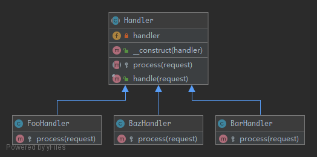

# ChainOfResponsibilities

To build a chain of objects to handle a call in sequential order. If one object cannot handle a call, it delegates the call to the next in the chain and so forth.

## UML



## Code

Handler.php

```php
<?php

namespace Kuriv\PHPDesignPatterns\Behavioral\ChainOfResponsibilities;

use Psr\Http\Message\RequestInterface;

abstract class Handler
{
    /**
     * Store the handler instance.
     *
     * @var Handler|null
     */
    private $handler = null;

    /**
     * Store the handler instance to the current instance.
     *
     * @param  Handler|null $handler
     * @return void
     */
    public function __construct(Handler $handler = null)
    {
        $this->handler = $handler;
    }

    /**
     * Return the processed data.
     *
     * @param  RequestInterface $request
     * @return string
     */
    final public function handle(RequestInterface $request): string
    {
        $data = $this->processing($request);
        if (empty($data) && isset($this->handler)) {
            $data = $this->handler->handle($request);
        }
        return $data;
    }

    /**
     * Processing required data.
     *
     * @param  RequestInterface $request
     * @return string
     */
    abstract protected function processing(RequestInterface $request): string;
}

```

SlowDatabaseHandler.php

```php
<?php

namespace Kuriv\PHPDesignPatterns\Behavioral\ChainOfResponsibilities;

use Psr\Http\Message\RequestInterface;

class SlowDatabaseHandler extends Handler
{
    /**
     * Processing required data.
     *
     * @param  RequestInterface $request
     * @return string
     */
    protected function processing(RequestInterface $request): string
    {
        return 'Hello World!';
    }
}

```

HttpInMemoryCacheHandler.php

```php
<?php

namespace Kuriv\PHPDesignPatterns\Behavioral\ChainOfResponsibilities;

use Psr\Http\Message\RequestInterface;

class HttpInMemoryCacheHandler extends Handler
{
    /**
     * Store some data here.
     *
     * @var array
     */
    private $data = [];

    /**
     * Store some data to the current instance and store the handler instance to the parent instance.
     *
     * @param  array        $data
     * @param  Handler|null $handler
     * @return void
     */
    public function __construct(array $data, Handler $handler = null)
    {
        $this->data = $data;
        parent::__construct($handler);
    }

    /**
     * Processing required data.
     *
     * @param  RequestInterface $request
     * @return string
     */
    protected function processing(RequestInterface $request): string
    {
        $key = sprintf('%s?%s', $request->getUri()->getPath(), $request->getUri()->getQuery());
        return ($request->getMethod() == 'GET' && isset($this->data[$key])) ? $this->data[$key] : '';
    }
}

```

## Test

ChainOfResponsibilitiesTest.php

```php
<?php

namespace Kuriv\PHPDesignPatterns\Behavioral\ChainOfResponsibilities;

use PHPUnit\Framework\TestCase;
use Psr\Http\Message\UriInterface;
use Psr\Http\Message\RequestInterface;

class ChainOfResponsibilitiesTest extends TestCase
{
    public function testCanRequestKeyInFastStorage()
    {
        $chain = new HttpInMemoryCacheHandler(['/foo/bar?index=1' => 'Hello In Memory!'], new SlowDatabaseHandler);
        $uri = $this->createMock(UriInterface::class);
        $uri->method('getPath')->willReturn('/foo/bar');
        $uri->method('getQuery')->willReturn('index=1');
        $request = $this->createMock(RequestInterface::class);
        $request->method('getMethod')->willReturn('GET');
        $request->method('getUri')->willReturn($uri);
        $this->assertSame('Hello In Memory!', $chain->handle($request));
    }

    public function testCanRequestKeyInSlowStorage()
    {
        $chain = new HttpInMemoryCacheHandler(['/foo/bar?index=1' => 'Hello In Memory!'], new SlowDatabaseHandler);
        $uri = $this->createMock(UriInterface::class);
        $uri->method('getPath')->willReturn('/foo/baz');
        $uri->method('getQuery')->willReturn('');
        $request = $this->createMock(RequestInterface::class);
        $request->method('getMethod')->willReturn('GET');
        $request->method('getUri')->willReturn($uri);
        $this->assertSame('Hello World!', $chain->handle($request));
    }
}

```

