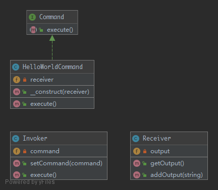

# Command

> To encapsulate invocation and decoupling. This pattern uses a "Command" to delegate the method call against the receiver and presents the same method. Therefore, the Invoker just knows to call the method to process the command of the client. This pattern can also be aggregated to combine more complex commands with minimum copy-paste and relying on composition over inheritance.

## UML



## Code

Command.php

```php
<?php

namespace Kuriv\PHPDesignPatterns\Behavioral\Command;

interface Command
{
    /**
     * Execute some commands here.
     *
     * @param  void
     * @return void
     */
    public function execute();
}

```

HelloWorldCommand.php

```php
<?php

namespace Kuriv\PHPDesignPatterns\Behavioral\Command;

class HelloWorldCommand implements Command
{
    /**
     * Store the receiver instance.
     *
     * @var Receiver
     */
    private Receiver $receiver;

    /**
     * Store the receiver instance to the current instance.
     *
     * @param  Receiver $receiver
     * @return void
     */
    public function __construct(Receiver $receiver)
    {
        $this->receiver = $receiver;
    }

    /**
     * Execute some commands here.
     *
     * @param  void
     * @return void
     */
    public function execute()
    {
        $this->receiver->addOutput('Hello World');
    }
}

```

Invoker.php

```php
<?php

namespace Kuriv\PHPDesignPatterns\Behavioral\Command;

class Invoker
{
    /**
     * Store the command instance.
     *
     * @var Command
     */
    private Command $command;

    /**
     * Store the command instance to the current instance.
     *
     * @param  Command $command
     * @return void
     */
    public function setCommand(Command $command)
    {
        $this->command = $command;
    }

    /**
     * Execute some commands here.
     *
     * @param  void
     * @return void
     */
    public function execute()
    {
        $this->command->execute();
    }
}

```

Receiver.php

```php
<?php

namespace Kuriv\PHPDesignPatterns\Behavioral\Command;

class Receiver
{
    /**
     * Store the output string.
     *
     * @var array
     */
    private array $output = [];

    /**
     * Add the output string.
     *
     * @param  string $string
     * @return void
     */
    public function addOutput(string $string)
    {
        $this->output[] = $string;
    }

    /**
     * Get the output string.
     *
     * @param  void
     * @return string
     */
    public function getOutput(): string
    {
        return implode("\n", $this->output);
    }
}

```

## Test

CommandTest.php

```php
<?php

namespace Kuriv\PHPDesignPatterns\Behavioral\Command;

use PHPUnit\Framework\TestCase;

class CommandTest extends TestCase
{
    public function testInvocation()
    {
        $invoker = new Invoker();
        $receiver = new Receiver();
        $invoker->setCommand(new HelloWorldCommand($receiver));
        $invoker->execute();
        $this->assertSame('Hello World', $receiver->getOutput());
    }
}

```

