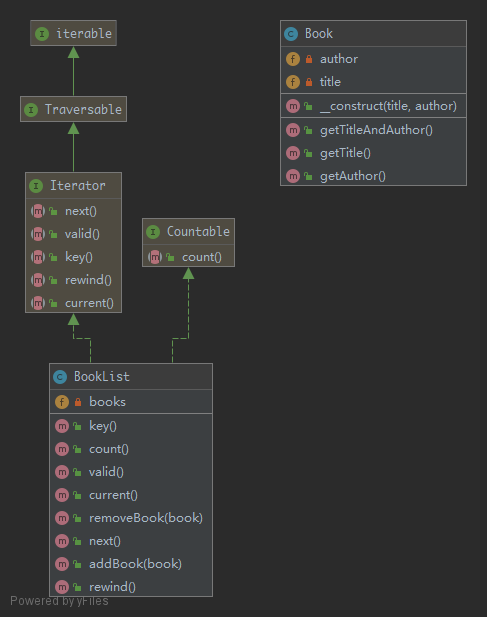

# Iterator

> To make an object iterable and to make it appear like a collection of objects.

## UML



## Code

Book.php

```php
<?php

namespace Kuriv\PHPDesignPatterns\Behavioral\Iterator;

class Book
{
    /**
     * Store the book title.
     *
     * @var string
     */
    private string $title;

    /**
     * Store the book author.
     *
     * @var string
     */
    private string $author;

    /**
     * Store the book title and book author to the current instance.
     *
     * @param  string $title
     * @param  string $author
     * @return void
     */
    public function __construct(string $title, string $author)
    {
        $this->title = $title;
        $this->author = $author;
    }

    /**
     * Get the book title.
     *
     * @param  void
     * @return string
     */
    public function getTitle(): string
    {
        return $this->title;
    }

    /**
     * Get the book author.
     *
     * @param  void
     * @return string
     */
    public function getAuthor(): string
    {
        return $this->author;
    }

    /**
     * Get the book title and book author.
     *
     * @param  void
     * @return string
     */
    public function getTitleAndAuthor(): string
    {
        return $this->getTitle() . ' by ' . $this->getAuthor();
    }
}

```

BookList.php

```php
<?php

namespace Kuriv\PHPDesignPatterns\Behavioral\Iterator;

use Countable;
use Iterator;

class BookList implements Countable, Iterator
{
    /**
     * Store several books.
     *
     * @var array
     */
    private array $books = [];

    /**
     * Count the total number of books.
     *
     * @param  void
     * @return int
     */
    public function count(): int
    {
        return count($this->books);
    }

    /**
     * Return the current element of the specified property.
     *
     * @param  void
     * @return Book
     */
    public function current(): Book
    {
        return current($this->books);
    }

    /**
     * Advance the internal pointer of the specified property.
     *
     * @param  void
     * @return void
     */
    public function next()
    {
        next($this->books);
    }

    /**
     * Return the current key of the specified property.
     *
     * @param  void
     * @return int
     */
    public function key(): int
    {
        return key($this->books);
    }

    /**
     * Return the validity of the current position of the specified property.
     *
     * @param  void
     * @return bool
     */
    public function valid(): bool
    {
        return current($this->books) !== false;
    }

    /**
     * Set the internal pointer of the specified property to the first element.
     *
     * @param  void
     * @return void
     */
    public function rewind()
    {
        reset($this->books);
    }

    /**
     * Add the book to the book list.
     *
     * @param  Book $book
     * @return void
     */
    public function addBook(Book $book)
    {
        foreach ($this->books as $value) {
            if ($value->getTitleAndAuthor() == $book->getTitleAndAuthor()) {
                return;
            }
        }
        $this->books[] = $book;
    }

    /**
     * Remove the book from the book list.
     *
     * @param  Book   $book
     * @return void
     */
    public function removeBook(Book $book)
    {
        foreach ($this->books as $key => $value) {
            if ($value->getTitleAndAuthor() == $book->getTitleAndAuthor()) {
                unset($this->books[$key]);
            }
        }
    }
}

```

## Test

IteratorTest.php

```php
<?php

namespace Kuriv\PHPDesignPatterns\Behavioral\Iterator;

use PHPUnit\Framework\TestCase;

class IteratorTest extends TestCase
{
    public function testCanAddBookToList()
    {
        $book = new Book('Clean Code', 'Robert C. Martin');
        $bookList = new BookList();
        $bookList->addBook($book);
        $bookList->addBook($book);
        $this->assertCount(1, $bookList);
    }

    public function testCanRemoveBookFromList()
    {
        $book = new Book('Clean Code', 'Robert C. Martin');
        $bookList = new BookList();
        $bookList->addBook($book);
        $bookList->removeBook($book);
        $this->assertCount(0, $bookList);
    }

    public function testCanIterateOverBookList()
    {
        $bookList = new BookList();
        $bookList->addBook(new Book('Learning PHP Design Patterns', 'William Sanders'));
        $bookList->addBook(new Book('Professional Php Design Patterns', 'Aaron Saray'));
        $bookList->addBook(new Book('Clean Code', 'Robert C. Martin'));
        foreach ($bookList as $book) {
            $books[] = $book->getTitleAndAuthor();
        }
        $this->assertSame([
            'Learning PHP Design Patterns by William Sanders',
            'Professional Php Design Patterns by Aaron Saray',
            'Clean Code by Robert C. Martin'
        ], $books);
    }

    public function testCanIterateOverBookListAfterRemovingBook()
    {
        $firstBook = new Book('Clean Code', 'Robert C. Martin');
        $secondBook = new Book('Professional Php Design Patterns', 'Aaron Saray');
        $bookList = new BookList();
        $bookList->addBook($firstBook);
        $bookList->addBook($secondBook);
        $bookList->removeBook($firstBook);
        foreach ($bookList as $book) {
            $books[] = $book->getTitleAndAuthor();
        }
        $this->assertSame([
            'Professional Php Design Patterns by Aaron Saray'
        ], $books);
    }
}

```

