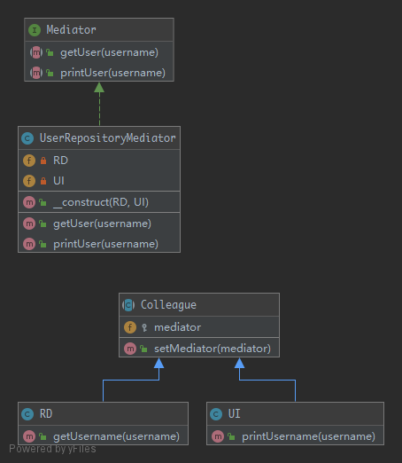

# Mediator

This pattern provides an easy way to decouple many components working together. All components are only coupled to the Mediator interface and it is a good thing because in OOP, one good friend is better than many. This is the key-feature of this pattern.

## UML



## Code

Mediator.php

```php
<?php

namespace Kuriv\PHPDesignPatterns\Behavioral\Mediator;

interface Mediator
{
    /**
     * Get the user.
     *
     * @param  string $username
     * @return string
     */
    public function getUser(string $username): string;

    /**
     * Print the user.
     *
     * @param  string $username
     * @return void
     */
    public function printUser(string $username);
}

```

UserRepositoryMediator.php

```php
<?php

namespace Kuriv\PHPDesignPatterns\Behavioral\Mediator;

class UserRepositoryMediator implements Mediator
{
    /**
     * Store the RD instance.
     *
     * @var RD
     */
    private $RD;

    /**
     * Store the UI instance.
     *
     * @var UI
     */
    private $UI;

    /**
     * Store the RD instance and UI instance to the current instance.
     *
     * @param  RD $RD
     * @param  UI $UI
     * @return void
     */
    public function __construct(RD $RD, UI $UI)
    {
        $this->RD = $RD;
        $this->UI = $UI;
        $this->RD->setMediator($this);
        $this->UI->setMediator($this);
    }

    /**
     * Get the user.
     *
     * @param  string $username
     * @return string
     */
    public function getUser(string $username): string
    {
        return $this->RD->getUsername($username);
    }

    /**
     * Print the user.
     *
     * @param  string $username
     * @return void
     */
    public function printUser(string $username)
    {
        $this->UI->printUsername($username);
    }
}

```

Colleague.php

```php
<?php

namespace Kuriv\PHPDesignPatterns\Behavioral\Mediator;

abstract class Colleague
{
    /**
     * Store the mediator instance.
     *
     * @var Mediator
     */
    protected $mediator;

    /**
     * Store the mediator instance to the current instance.
     *
     * @param  Mediator $mediator
     * @return void
     */
    public function setMediator(Mediator $mediator)
    {
        $this->mediator = $mediator;
    }
}

```

RD.php

```php
<?php

namespace Kuriv\PHPDesignPatterns\Behavioral\Mediator;

class RD extends Colleague
{
    /**
     * Get the username.
     *
     * @param  string $username
     * @return string
     */
    public function getUsername(string $username): string
    {
        return 'Username: ' . $username;
    }
}

```

UI.php

```php
<?php

namespace Kuriv\PHPDesignPatterns\Behavioral\Mediator;

class UI extends Colleague
{
    /**
     * Print the username.
     *
     * @param  string $username
     * @return void
     */
    public function printUsername(string $username)
    {
        print $this->mediator->getUser($username);
    }
}

```

## Test

MediatorTest.php

```php
<?php

namespace Kuriv\PHPDesignPatterns\Behavioral\Mediator;

use PHPUnit\Framework\TestCase;

class MediatorTest extends TestCase
{
    public function testPrintUser()
    {
        $mediator = new UserRepositoryMediator(new RD, new UI);
        $this->expectOutputString('Username: Kuriv');
        $mediator->printUser('Kuriv');
    }
}

```

