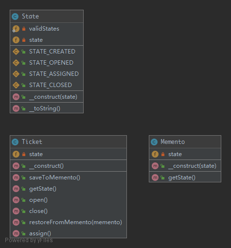

# Memento

This pattern provides the ability to restore an object to it's previous state or to gain access to state of the object.

## UML



## Code

State.php

```php
<?php

namespace Kuriv\PHPDesignPatterns\Behavioral\Memento;

use InvalidArgumentException;

class State
{
    /**
     * Just a test constant.
     *
     * @var string
     */
    const STATE_CREATED = 'Created';

    /**
     * Just a test constant.
     *
     * @var string
     */
    const STATE_OPENED = 'Opened';

    /**
     * Just a test constant.
     *
     * @var string
     */
    const STATE_ASSIGNED = 'Assigned';

    /**
     * Just a test constant.
     *
     * @var string
     */
    const STATE_CLOSED = 'Closed';

    /**
     * Store the state.
     *
     * @var string
     */
    private string $state;

    /**
     * Define an array of allowed states.
     *
     * @var array
     */
    private static array $validStates = [
        self::STATE_CREATED,
        self::STATE_OPENED,
        self::STATE_ASSIGNED,
        self::STATE_CLOSED
    ];

    /**
     * Store the state to the current instance.
     *
     * @param  string $state
     * @return void
     */
    public function __construct(string $state)
    {
        if (!in_array($state, self::$validStates)) {
            throw new InvalidArgumentException('Invalid state given');
        }
        $this->state = $state;
    }

    /**
     * Get the state string.
     *
     * @param  void
     * @return string
     */
    public function __toString(): string
    {
        return $this->state;
    }
}

```

Ticket.php

```php
<?php

namespace Kuriv\PHPDesignPatterns\Behavioral\Memento;

class Ticket
{
    /**
     * Store the state instance.
     *
     * @var State
     */
    private State $state;

    /**
     * Store the state instance to the current instance.
     *
     * @param  void
     * @return void
     */
    public function __construct()
    {
        $this->state = new State(State::STATE_CREATED);
    }

    /**
     * Set the new state instance.
     *
     * @param  void
     * @return void
     */
    public function open()
    {
        $this->state = new State(State::STATE_OPENED);
    }

    /**
     * Set the new state instance.
     *
     * @param  void
     * @return void
     */
    public function assign()
    {
        $this->state = new State(State::STATE_ASSIGNED);
    }

    /**
     * Set the new state instance.
     *
     * @param  void
     * @return void
     */
    public function close()
    {
        $this->state = new State(State::STATE_CLOSED);
    }

    /**
     * Save the state instance to the memento instance.
     *
     * @param  void
     * @return Memento
     */
    public function saveToMemento(): Memento
    {
        return new Memento(clone $this->state);
    }

    /**
     * Restore the state instance from the memento instance.
     *
     * @param  Memento $memento
     * @return void
     */
    public function restoreFromMemento(Memento $memento)
    {
        $this->state = $memento->getState();
    }

    /**
     * Get the state instance.
     *
     * @param  void
     * @return State
     */
    public function getState(): State
    {
        return $this->state;
    }
}

```

Memento.php

```php
<?php

namespace Kuriv\PHPDesignPatterns\Behavioral\Memento;

class Memento
{
    /**
     * Store the state instance.
     *
     * @var State
     */
    private State $state;

    /**
     * Store the state instance to the current instance.
     *
     * @param  State $state
     * @return void
     */
    public function __construct(State $state)
    {
        $this->state = $state;
    }

    /**
     * Get the state instance.
     *
     * @param  void
     * @return State
     */
    public function getState(): State
    {
        return $this->state;
    }
}

```

## Test

MementoTest.php

```php
<?php

namespace Kuriv\PHPDesignPatterns\Behavioral\Memento;

use PHPUnit\Framework\TestCase;

class MementoTest extends TestCase
{
    public function testOpenTicketAssignAndSetBackToOpen()
    {
        $ticket = new Ticket;
        $ticket->open();
        $this->assertSame(State::STATE_OPENED, (string) $ticket->getState());

        $memento = $ticket->saveToMemento();
        $ticket->assign();
        $this->assertSame(State::STATE_ASSIGNED, (string) $ticket->getState());

        $ticket->restoreFromMemento($memento);
        $this->assertSame(State::STATE_OPENED, (string) $ticket->getState());
    }
}

```

