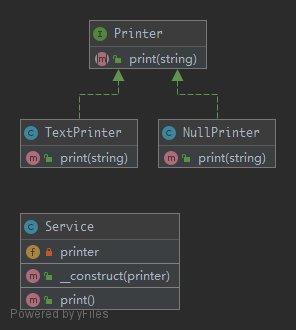

# NullObject

`NullObject` is not a GoF design pattern but a schema which appears frequently enough to be considered a pattern.

## UML



## Code

Printer.php

```php
<?php

namespace PHPDesignPatterns\Behavioral\NullObject;

interface Printer
{
    /**
     * Print the input string.
     *
     * @param  string $string
     * @return void
     */
    public function print(string $string);
}

```

TextPrinter.php

```php
<?php

namespace PHPDesignPatterns\Behavioral\NullObject;

class TextPrinter implements Printer
{
    /**
     * Print the input string.
     *
     * @param  string $string
     * @return void
     */
    public function print(string $string)
    {
        print $string;
    }
}

```

NullPrinter.php

```php
<?php

namespace PHPDesignPatterns\Behavioral\NullObject;

class NullPrinter implements Printer
{
    /**
     * Print nothing.
     *
     * @param  string $string
     * @return void
     */
    public function print(string $string)
    {
    }
}

```

Service.php

```php
<?php

namespace PHPDesignPatterns\Behavioral\NullObject;

class Service
{
    /**
     * Store the printer instance.
     *
     * @var Printer
     */
    private $printer;

    /**
     * Store the printer instance to the current instance.
     *
     * @param  Printer $printer
     * @return void
     */
    public function __construct(Printer $printer)
    {
        $this->printer = $printer;
    }

    /**
     * Test something here.
     *
     * @param  void
     * @return void
     */
    public function test()
    {
        $this->printer->print('You are now in ' . __METHOD__);
    }
}

```

## Test

NullObjectTest.php

```php
<?php

namespace PHPDesignPatterns\Behavioral\NullObject;

use PHPUnit\Framework\TestCase;

class NullObjectTest extends TestCase
{
    public function testTextPrinter()
    {
        $service = new Service(new TextPrinter);
        $this->expectOutputString('You are now in PHPDesignPatterns\Behavioral\NullObject\Service::test');
        $service->test();
    }

    public function testNullPrinter()
    {
        $service = new Service(new NullPrinter);
        $this->expectOutputString('');
        $service->test();
    }
}

```

