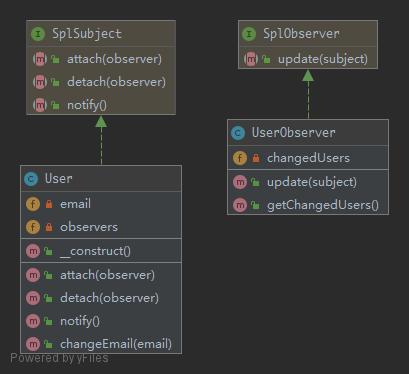

# Observer

To implement a publish/subscribe behaviour to an object, whenever a "Subject" object changes its state, the attached "Observers" will be notified. It is used to shorten the amount of coupled objects and uses loose coupling instead.

## UML



## Code

User.php

```php
<?php

namespace Kuriv\PHPDesignPatterns\Behavioral\Observer;

use SplSubject;
use SplObjectStorage;
use SplObserver;

class User implements SplSubject
{
    /**
     * Store the email.
     *
     * @var string
     */
    private $email;

    /**
     * Store the object storage instance.
     *
     * @var SplObjectStorage
     */
    private $observers;

    /**
     * Store the object storage instance to the current instance.
     *
     * @param  void
     * @return void
     */
    public function __construct()
    {
        $this->observers = new SplObjectStorage;
    }

    /**
     * Attach an observer instance.
     *
     * @param  SplObserver $observer
     * @return void
     */
    public function attach(SplObserver $observer)
    {
        $this->observers->attach($observer);
    }

    /**
     * Detach an observer instance.
     *
     * @param  SplObserver $observer
     * @return void
     */
    public function detach(SplObserver $observer)
    {
        $this->observers->detach($observer);
    }

    /**
     * Perform notify action.
     *
     * @param  void
     * @return void
     */
    public function notify()
    {
        foreach ($this->observers as $observer) {
            $observer->update($this);
        }
    }

    /**
     * Change the email and notify.
     *
     * @param  string $email
     * @return void
     */
    public function changeEmail(string $email)
    {
        $this->email = $email;
        $this->notify();
    }
}

```

UserObserver.php

```php
<?php

namespace Kuriv\PHPDesignPatterns\Behavioral\Observer;

use SplObserver;
use SplSubject;

class UserObserver implements SplObserver
{
    /**
     * Store the changed users.
     *
     * @var array
     */
    private $changedUsers = [];

    /**
     * Update the property.
     *
     * @param  SplSubject $subject
     * @return void
     */
    public function update(SplSubject $subject)
    {
        $this->changedUsers[] = clone $subject;
    }

    /**
     * Get all changed users.
     *
     * @param  void
     * @return array
     */
    public function getChangedUsers(): array
    {
        return $this->changedUsers;
    }
}

```

## Test

ObserverTest.php

```php
<?php

namespace Kuriv\PHPDesignPatterns\Behavioral\Observer;

use PHPUnit\Framework\TestCase;

class ObserverTest extends TestCase
{
    public function testChangeInUserLeadsToUserObserverBeingNotified()
    {
        $user = new User();
        $observer = new UserObserver;
        $user->attach($observer);
        $user->changeEmail('foo@foo.com');
        $this->assertCount(1, $observer->getChangedUsers());
    }
}

```

