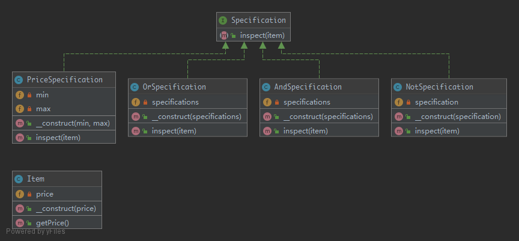

# Specification

Builds a clear specification of business rules, where objects can be checked against.

## UML



## Code

Specification.php

```php
<?php

namespace Kuriv\PHPDesignPatterns\Behavioral\Specification;

interface Specification
{
    /**
     * Return the result of inspect.
     *
     * @param  Item   $item
     * @return bool
     */
    public function inspect(Item $item): bool;
}

```

PriceSpecification.php

```php
<?php

namespace Kuriv\PHPDesignPatterns\Behavioral\Specification;

class PriceSpecification implements Specification
{
    /**
     * Store the min price.
     *
     * @var float
     */
    private $min;

    /**
     * Store the min price.
     *
     * @var float
     */
    private $max;

    /**
     * Store the min price and max price to the current instance.
     *
     * @param  float $min
     * @param  float $max
     * @return void
     */
    public function __construct(float $min, float $max)
    {
        $this->min = $min;
        $this->max = $max;
    }

    /**
     * Return the result of inspect.
     *
     * @param  Item   $item
     * @return bool
     */
    public function inspect(Item $item): bool
    {
        return ($item->getPrice() > $this->max || $item->getPrice() < $this->min) ? false : true;
    }
}

```

OrSpecification.php

```php
<?php

namespace Kuriv\PHPDesignPatterns\Behavioral\Specification;

class OrSpecification implements Specification
{
    /**
     * Store several specification instances.
     *
     * @var array
     */
    private $specifications = [];

    /**
     * Store several specification instances to the current instance.
     *
     * @param  Specification $specifications
     * @return void
     */
    public function __construct(Specification ...$specifications)
    {
        $this->specifications = $specifications;
    }

    /**
     * Return the result of inspect.
     *
     * @param  Item   $item
     * @return bool
     */
    public function inspect(Item $item): bool
    {
        foreach ($this->specifications as $specification) {
            if ($specification->inspect($item)) {
                return true;
            }
        }
        return false;
    }
}

```

AndSpecification.php

```php
<?php

namespace Kuriv\PHPDesignPatterns\Behavioral\Specification;

class AndSpecification implements Specification
{
    /**
     * Store several specification instances.
     *
     * @var array
     */
    private $specifications = [];

    /**
     * Store several specification instances to the current instance.
     *
     * @param  Specification $specifications
     * @return void
     */
    public function __construct(Specification ...$specifications)
    {
        $this->specifications = $specifications;
    }

    /**
     * Return the result of inspect.
     *
     * @param  Item   $item
     * @return bool
     */
    public function inspect(Item $item): bool
    {
        foreach ($this->specifications as $specification) {
            if (!$specification->inspect($item)) {
                return false;
            }
        }
        return true;
    }
}

```

NotSpecification.php

```php
<?php

namespace Kuriv\PHPDesignPatterns\Behavioral\Specification;

class NotSpecification implements Specification
{
    /**
     * Store the specification instance.
     *
     * @var Specification
     */
    private $specification;

    /**
     * Store the specification instance to the current instance.
     *
     * @param  Specification $specification
     * @return void
     */
    public function __construct(Specification $specification)
    {
        $this->specification = $specification;
    }

    /**
     * Return the result of inspect.
     *
     * @param  Item   $item
     * @return bool
     */
    public function inspect(Item $item): bool
    {
        return !$this->specification->inspect($item);
    }
}

```

Item.php

```php
<?php

namespace Kuriv\PHPDesignPatterns\Behavioral\Specification;

class Item
{
    /**
     * Store the price.
     *
     * @var float
     */
    private $price;

    /**
     * Store the price to the current instance.
     *
     * @param  float $price
     * @return void
     */
    public function __construct(float $price)
    {
        $this->price = $price;
    }

    /**
     * Get the price.
     *
     * @param  void
     * @return float
     */
    public function getPrice(): float
    {
        return $this->price;
    }
}

```

## Test

SpecificationTest.php

```php
<?php

namespace Kuriv\PHPDesignPatterns\Behavioral\Specification;

use PHPUnit\Framework\TestCase;

class SpecificationTest extends TestCase
{
    public function testCanOr()
    {
        $firstSpecification = new PriceSpecification(50, 99);
        $secondSpecification = new PriceSpecification(101, 200);
        $orSpecification = new OrSpecification($firstSpecification, $secondSpecification);
        $this->assertFalse($orSpecification->inspect(new Item(100)));
        $this->assertTrue($orSpecification->inspect(new Item(51)));
        $this->assertTrue($orSpecification->inspect(new Item(150)));
    }

    public function testCanAnd()
    {
        $firstSpecification = new PriceSpecification(50, 100);
        $secondSpecification = new PriceSpecification(80, 200);
        $andSpecification = new AndSpecification($firstSpecification, $secondSpecification);
        $this->assertFalse($andSpecification->inspect(new Item(150)));
        $this->assertFalse($andSpecification->inspect(new Item(1)));
        $this->assertFalse($andSpecification->inspect(new Item(51)));
        $this->assertTrue($andSpecification->inspect(new Item(100)));
    }

    public function testCanNot()
    {
        $firstSpecification = new PriceSpecification(50, 100);
        $notSpecification = new NotSpecification($firstSpecification);
        $this->assertTrue($notSpecification->inspect(new Item(150)));
        $this->assertFalse($notSpecification->inspect(new Item(50)));
    }
}

```

