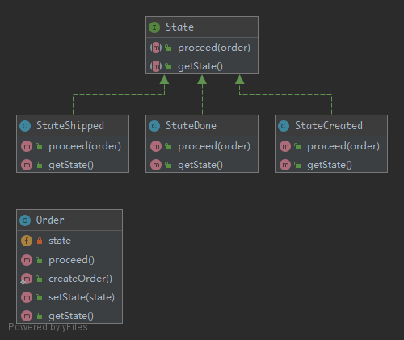

# State

> Encapsulate varying behavior for the same routine based on an object's state. This can be a cleaner way for an object to change its behavior at runtime without resorting to large monolithic conditional statements.

## UML



## Code

State.php

```php
<?php

namespace Kuriv\PHPDesignPatterns\Behavioral\State;

interface State
{
    /**
     * Proceed to the next state.
     *
     * @param  Order  $order
     * @return void
     */
    public function proceed(Order $order);

    /**
     * Get the current state.
     *
     * @param  void
     * @return string
     */
    public function getState(): string;
}

```

StateCreated.php

```php
<?php

namespace Kuriv\PHPDesignPatterns\Behavioral\State;

class StateCreated implements State
{
    /**
     * Proceed to the next state.
     *
     * @param  Order  $order
     * @return void
     */
    public function proceed(Order $order)
    {
        $order->setState(new StateShipped);
    }

    /**
     * Get the current state.
     *
     * @param  void
     * @return string
     */
    public function getState(): string
    {
        return 'StateCreated';
    }
}

```

StateShipped.php

```php
<?php

namespace Kuriv\PHPDesignPatterns\Behavioral\State;

class StateShipped implements State
{
    /**
     * Proceed to the next state.
     *
     * @param  Order  $order
     * @return void
     */
    public function proceed(Order $order)
    {
        $order->setState(new StateDone);
    }

    /**
     * Get the current state.
     *
     * @param  void
     * @return string
     */
    public function getState(): string
    {
        return 'StateShipped';
    }
}

```

StateDone.php

```php
<?php

namespace Kuriv\PHPDesignPatterns\Behavioral\State;

class StateDone implements State
{
    /**
     * Proceed to the next state.
     *
     * @param  Order  $order
     * @return void
     */
    public function proceed(Order $order)
    {
    }

    /**
     * Get the current state.
     *
     * @param  void
     * @return string
     */
    public function getState(): string
    {
        return 'StateDone';
    }
}

```

Order.php

```php
<?php

namespace Kuriv\PHPDesignPatterns\Behavioral\State;

class Order
{
    /**
     * Store the state instance.
     *
     * @var State
     */
    private State $state;

    /**
     * Create an order.
     *
     * @param  void
     * @return Order
     */
    public static function createOrder(): Order
    {
        $order = new self;
        $order->setState(new StateCreated);
        return $order;
    }

    /**
     * Set the new state instance.
     *
     * @param  State $state
     * @return void
     */
    public function setState(State $state)
    {
        $this->state = $state;
    }

    /**
     * Proceed to the next state.
     *
     * @param  void
     * @return void
     */
    public function proceed()
    {
        $this->state->proceed($this);
    }

    /**
     * Get the current state.
     *
     * @param  void
     * @return string
     */
    public function getState(): string
    {
        return $this->state->getState();
    }
}

```

## Test

StateTest.php

```php
<?php

namespace Kuriv\PHPDesignPatterns\Behavioral\State;

use PHPUnit\Framework\TestCase;

class StateTest extends TestCase
{
    public function testIsCreatedWithStateCreated()
    {
        $order = Order::createOrder();
        $this->assertSame('StateCreated', $order->getState());
    }

    public function testCanProceedToStateShipped()
    {
        $order = Order::createOrder();
        $order->proceed();
        $this->assertSame('StateShipped', $order->getState());
    }

    public function testCanProceedToStateDone()
    {
        $order = Order::createOrder();
        $order->proceed();
        $order->proceed();
        $this->assertSame('StateDone', $order->getState());
    }

    public function testStateDoneIsTheLastPossibleState()
    {
        $order = Order::createOrder();
        $order->proceed();
        $order->proceed();
        $order->proceed();
        $this->assertSame('StateDone', $order->getState());
    }
}

```

