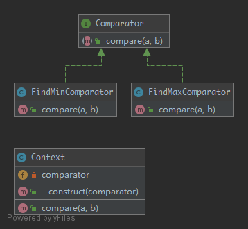

# Strategy

> To separate strategies and to enable fast switching between them. Also this pattern is a good alternative to inheritance, instead of having an abstract class that is extended.

## UML



## Code

Comparator.php

```php
<?php

namespace Kuriv\PHPDesignPatterns\Behavioral\Strategy;

interface Comparator
{
    /**
     * Return the result of the comparison.
     *
     * @param  int    $a
     * @param  int    $b
     * @return int
     */
    public function compare(int $a, int $b): int;
}

```

FindMinComparator.php

```php
<?php

namespace Kuriv\PHPDesignPatterns\Behavioral\Strategy;

class FindMinComparator implements Comparator
{
    /**
     * Return the result of the comparison.
     *
     * @param  int    $a
     * @param  int    $b
     * @return int
     */
    public function compare(int $a, int $b): int
    {
        return min($a, $b);
    }
}

```

FindMaxComparator.php

```php
<?php

namespace Kuriv\PHPDesignPatterns\Behavioral\Strategy;

class FindMaxComparator implements Comparator
{
    /**
     * Return the result of the comparison.
     *
     * @param  int    $a
     * @param  int    $b
     * @return int
     */
    public function compare(int $a, int $b): int
    {
        return max($a, $b);
    }
}

```

Context.php

```php
<?php

namespace Kuriv\PHPDesignPatterns\Behavioral\Strategy;

class Context
{
    /**
     * Store the comparator instance.
     *
     * @var Comparator
     */
    private Comparator $comparator;

    /**
     * Store the comparator instance to the current instance.
     *
     * @param  Comparator $comparator
     * @return void
     */
    public function __construct(Comparator $comparator)
    {
        $this->comparator = $comparator;
    }

    /**
     * Return the result of the comparison.
     *
     * @param  int    $a
     * @param  int    $b
     * @return int
     */
    public function compare(int $a, int $b): int
    {
        return $this->comparator->compare($a, $b);
    }
}

```

## Test

StrategyTest.php

```php
<?php

namespace Kuriv\PHPDesignPatterns\Behavioral\Strategy;

use PHPUnit\Framework\TestCase;

class StrategyTest extends TestCase
{
    private int $a = 2;

    private int $b = 3;

    public function testFindMinComparator()
    {
        $context = new Context(new FindMinComparator());
        $min = $context->compare($this->a, $this->b);
        $this->assertEquals(2, $min);
    }

    public function testFindMaxComparator()
    {
        $context = new Context(new FindMaxComparator());
        $max = $context->compare($this->a, $this->b);
        $this->assertEquals(3, $max);
    }
}

```

