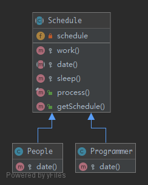

# TemplateMethod

`TemplateMethod` is a behavioral design pattern. Perhaps you have encountered it many times already. The idea is to let subclasses of this abstract template "finish" the behavior of an algorithm. The user has just to implement one method and the superclass do the job. It is an easy way to decouple concrete classes and reduce copy-paste, that's why you'll find it everywhere.

## UML



## Code

Schedule.php

```php
<?php

namespace PHPDesignPatterns\Behavioral\TemplateMethod;

abstract class Schedule
{
    /**
     * Daily schedule.
     *
     * @var array
     */
    private $schedule = [];

    /**
     * Go to work.
     *
     * @param  void
     * @return string
     */
    protected function work(): string
    {
        return 'Go to work';
    }

    /**
     * Date with girlfriend.
     *
     * @param  void
     * @return string
     */
    abstract protected function date(): string;

    /**
     * Go to sleep.
     *
     * @param  void
     * @return string
     */
    protected function sleep(): string
    {
        return 'Go to sleep';
    }

    /**
     * Get all the things done.
     *
     * @param  void
     * @return void
     */
    final public function process()
    {
        $this->schedule[] = $this->work();
        $this->schedule[] = $this->date();
        $this->schedule[] = $this->sleep();
    }

    /**
     * Get daily schedule.
     *
     * @param  void
     * @return array
     */
    public function getSchedule(): array
    {
        return $this->schedule;
    }
}

```

People.php

```php
<?php

namespace PHPDesignPatterns\Behavioral\TemplateMethod;

class People extends Schedule
{
    /**
     * Date with girlfriend.
     *
     * @param  void
     * @return string
     */
    protected function date(): string
    {
        return 'Date with girlfriend';
    }
}

```

Programmer.php

```php
<?php

namespace PHPDesignPatterns\Behavioral\TemplateMethod;

class Programmer extends Schedule
{
    /**
     * Date with girlfriend.
     *
     * @param  void
     * @return string
     */
    protected function date(): string
    {
        return 'Programmer has no girlfriend';
    }
}

```

## Test

TemplateMethodTest.php

```php
<?php

namespace PHPDesignPatterns\Behavioral\TemplateMethod;

use PHPUnit\Framework\TestCase;

class TemplateMethodTest extends TestCase
{
    public function testCanGetScheduleOfPeople()
    {
        $people = new People;
        $people->process();
        $this->assertEquals(
            ['Go to work', 'Date with girlfriend', 'Go to sleep'],
            $people->getSchedule()
        );
    }

    public function testCanGetScheduleOfProgrammer()
    {
        $programmer = new Programmer;
        $programmer->process();
        $this->assertEquals(
            ['Go to work', 'Programmer has no girlfriend', 'Go to sleep'],
            $programmer->getSchedule()
        );
    }
}

```

