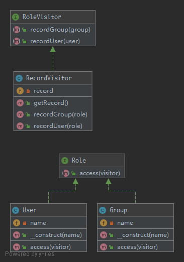

# Visitor

This pattern lets you outsource operations on objects to other objects. The main reason to do this is to keep a separation of concerns. But classes have to define a contract to allow visitors. The contract is an abstract class but you can have also a clean interface. In that case, each Visitor has to choose itself which method to invoke on the visitor.

## UML



## Code

Role.php

```php
<?php

namespace Kuriv\PHPDesignPatterns\Behavioral\Visitor;

interface Role
{
    /**
     * Allow role access.
     *
     * @param  RoleVisitor $visitor
     * @return void
     */
    public function access(RoleVisitor $visitor);
}

```

User.php

```php
<?php

namespace Kuriv\PHPDesignPatterns\Behavioral\Visitor;

class User implements Role
{
    /**
     * Store the name.
     *
     * @var string
     */
    private $name;

    /**
     * Store the name to the current instance.
     *
     * @param  string $name
     * @return void
     */
    public function __construct(string $name)
    {
        $this->name = $name;
    }

    /**
     * Allow role access.
     *
     * @param  RoleVisitor $visitor
     * @return void
     */
    public function access(RoleVisitor $visitor)
    {
        $visitor->recordUser($this);
    }
}

```

Group.php

```php
<?php

namespace Kuriv\PHPDesignPatterns\Behavioral\Visitor;

class Group implements Role
{
    /**
     * Store the name.
     *
     * @var string
     */
    private $name;

    /**
     * Store the name to the current instance.
     *
     * @param  string $name
     * @return void
     */
    public function __construct(string $name)
    {
        $this->name = $name;
    }

    /**
     * Allow role access.
     *
     * @param  RoleVisitor $visitor
     * @return void
     */
    public function access(RoleVisitor $visitor)
    {
        $visitor->recordGroup($this);
    }
}

```

RoleVisitor.php

```php
<?php

namespace Kuriv\PHPDesignPatterns\Behavioral\Visitor;

interface RoleVisitor
{
    /**
     * Record user access.
     *
     * @param  User   $role
     * @return void
     */
    public function recordUser(User $role);

    /**
     * Record group access.
     *
     * @param  Group  $role
     * @return void
     */
    public function recordGroup(Group $role);
}

```

RecordVisitor.php

```php
<?php

namespace Kuriv\PHPDesignPatterns\Behavioral\Visitor;

class RecordVisitor implements RoleVisitor
{
    /**
     * Store the access record.
     *
     * @var array
     */
    private $record = [];

    /**
     * Record user access.
     *
     * @param  User   $role
     * @return void
     */
    public function recordUser(User $role)
    {
        $this->record[] = $role;
    }

    /**
     * Record group access.
     *
     * @param  Group  $role
     * @return void
     */
    public function recordGroup(Group $role)
    {
        $this->record[] = $role;
    }

    /**
     * Get all the records.
     *
     * @param  void
     * @return array
     */
    public function getRecord(): array
    {
        return $this->record;
    }
}

```

## Test

VisitorTest.php

```php
<?php

namespace Kuriv\PHPDesignPatterns\Behavioral\Visitor;

use PHPUnit\Framework\TestCase;

class VisitorTest extends TestCase
{
    public function testVisitSomeRole()
    {
        $visitor = new RecordVisitor;
        $role = new User('Kuriv');
        $role->access($visitor);
        $this->assertSame($role, $visitor->getRecord()[0]);

        $role = new Group('Administrators');
        $role->access($visitor);
        $this->assertSame($role, $visitor->getRecord()[1]);
    }
}

```

