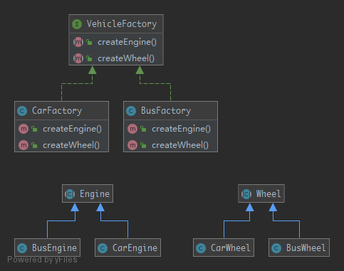

# AbstractFactory

> To create series of related or dependent objects without specifying their concrete classes. Usually the created classes all implement the same interface. The client of this pattern does not care about how these objects are created, it just knows how they go together.

## UML



## Code

Engine.php

```php
<?php

namespace Kuriv\PHPDesignPatterns\Creational\AbstractFactory;

abstract class Engine
{
    //
}

```

BusEngine.php

```php
<?php

namespace Kuriv\PHPDesignPatterns\Creational\AbstractFactory;

class BusEngine extends Engine
{
    //
}

```

CarEngine.php

```php
<?php

namespace Kuriv\PHPDesignPatterns\Creational\AbstractFactory;

class CarEngine extends Engine
{
    //
}

```

Wheel.php

```php
<?php

namespace Kuriv\PHPDesignPatterns\Creational\AbstractFactory;

abstract class Wheel
{
    //
}

```

BusWheel.php

```php
<?php

namespace Kuriv\PHPDesignPatterns\Creational\AbstractFactory;

class BusWheel extends Wheel
{
    //
}

```

CarWheel.php

```php
<?php

namespace Kuriv\PHPDesignPatterns\Creational\AbstractFactory;

class CarWheel extends Wheel
{
    //
}

```

VehicleFactory.php

```php
<?php

namespace Kuriv\PHPDesignPatterns\Creational\AbstractFactory;

interface VehicleFactory
{
    /**
     * Create engine.
     *
     * @param  void
     * @return Engine
     */
    public function createEngine(): Engine;

    /**
     * Create wheel.
     *
     * @param  void
     * @return Wheel
     */
    public function createWheel(): Wheel;
}

```

BusFactory.php

```php
<?php

namespace Kuriv\PHPDesignPatterns\Creational\AbstractFactory;

class BusFactory implements VehicleFactory
{
    /**
     * Create engine.
     *
     * @param  void
     * @return Engine
     */
    public function createEngine(): Engine
    {
        return new BusEngine();
    }

    /**
     * Create wheel.
     *
     * @param  void
     * @return Wheel
     */
    public function createWheel(): Wheel
    {
        return new BusWheel();
    }
}

```

CarFactory.php

```php
<?php

namespace Kuriv\PHPDesignPatterns\Creational\AbstractFactory;

class CarFactory implements VehicleFactory
{
    /**
     * Create engine.
     *
     * @param  void
     * @return Engine
     */
    public function createEngine(): Engine
    {
        return new CarEngine();
    }

    /**
     * Create wheel.
     *
     * @param  void
     * @return Wheel
     */
    public function createWheel(): Wheel
    {
        return new CarWheel();
    }
}

```

## Test

AbstractFactoryTest.php

```php
<?php

namespace Kuriv\PHPDesignPatterns\Creational\AbstractFactory;

use PHPUnit\Framework\TestCase;

class AbstractFactoryTest extends TestCase
{
    public function testCanCreateBusEngine()
    {
        $busFactory = new BusFactory();
        $busEngine = $busFactory->createEngine();
        $this->assertInstanceOf(Engine::class, $busEngine);
    }

    public function testCanCreateBusWheel()
    {
        $busFactory = new BusFactory();
        $busWheel = $busFactory->createWheel();
        $this->assertInstanceOf(Wheel::class, $busWheel);
    }

    public function testCanCreateCarEngine()
    {
        $carFactory = new CarFactory();
        $carEngine = $carFactory->createEngine();
        $this->assertInstanceOf(Engine::class, $carEngine);
    }

    public function testCanCreateCarWheel()
    {
        $carFactory = new CarFactory();
        $carWheel = $carFactory->createWheel();
        $this->assertInstanceOf(Wheel::class, $carWheel);
    }
}

```

