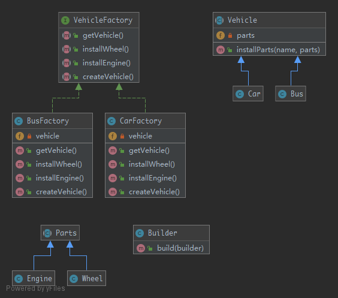

# Builder

`Builder` is an interface that build parts of a complex object. Sometimes, if the builder has a better knowledge of what it builds, this interface could be an abstract class with default methods. If you have a complex inheritance tree for objects, it is logical to have a complex inheritance tree for builders too.

## UML



## Code

Parts.php

```php
<?php

namespace Kuriv\PHPDesignPatterns\Creational\Builder;

abstract class Parts
{
}

```

Engine.php

```php
<?php

namespace Kuriv\PHPDesignPatterns\Creational\Builder;

class Engine extends Parts
{
}

```

Wheel.php

```php
<?php

namespace Kuriv\PHPDesignPatterns\Creational\Builder;

class Wheel extends Parts
{
}

```

Vehicle.php

```php
<?php

namespace Kuriv\PHPDesignPatterns\Creational\Builder;

abstract class Vehicle
{
    /**
     * Current vehicle parts.
     *
     * @var array
     */
    private $parts = [];

    /**
     * Install parts for the vehicle.
     *
     * @param  string $name
     * @param  Parts  $parts
     * @return void
     */
    public function installParts(string $name, Parts $parts)
    {
        $this->parts[$name] = $parts;
    }
}

```

Bus.php

```php
<?php

namespace Kuriv\PHPDesignPatterns\Creational\Builder;

class Bus extends Vehicle
{
}

```

Car.php

```php
<?php

namespace Kuriv\PHPDesignPatterns\Creational\Builder;

class Car extends Vehicle
{
}

```

VehicleFactory.php

```php
<?php

namespace Kuriv\PHPDesignPatterns\Creational\Builder;

interface VehicleFactory
{
    /**
     * Create vehicle.
     *
     * @param  void
     * @return void
     */
    public function createVehicle();

    /**
     * Install engine.
     *
     * @param  void
     * @return void
     */
    public function installEngine();

    /**
     * Install wheel.
     *
     * @param  void
     * @return void
     */
    public function installWheel();

    /**
     * Get vehicle.
     *
     * @param  void
     * @return Vehicle
     */
    public function getVehicle(): Vehicle;
}

```

BusFactory.php

```php
<?php

namespace Kuriv\PHPDesignPatterns\Creational\Builder;

class BusFactory implements VehicleFactory
{
    /**
     * Current vehicle.
     *
     * @var Vehicle
     */
    private $vehicle;

    /**
     * Create vehicle.
     *
     * @param  void
     * @return void
     */
    public function createVehicle()
    {
        $this->vehicle = new Bus;
    }

    /**
     * Install engine.
     *
     * @param  void
     * @return void
     */
    public function installEngine()
    {
        $this->vehicle->installParts('busEngine', new Engine);
    }

    /**
     * Install wheel.
     *
     * @param  void
     * @return void
     */
    public function installWheel()
    {
        $this->vehicle->installParts('busWheel1', new Wheel);
        $this->vehicle->installParts('busWheel2', new Wheel);
        $this->vehicle->installParts('busWheel3', new Wheel);
        $this->vehicle->installParts('busWheel4', new Wheel);
    }

    /**
     * Get vehicle.
     *
     * @param  void
     * @return Vehicle
     */
    public function getVehicle(): Vehicle
    {
        return $this->vehicle;
    }
}

```

CarFactory.php

```php
<?php

namespace Kuriv\PHPDesignPatterns\Creational\Builder;

class CarFactory implements VehicleFactory
{
    /**
     * Current vehicle.
     *
     * @var Vehicle
     */
    private $vehicle;

    /**
     * Create vehicle.
     *
     * @param  void
     * @return void
     */
    public function createVehicle()
    {
        $this->vehicle = new Car;
    }

    /**
     * Install engine.
     *
     * @param  void
     * @return void
     */
    public function installEngine()
    {
        $this->vehicle->installParts('carEngine', new Engine);
    }

    /**
     * Install wheel.
     *
     * @param  void
     * @return void
     */
    public function installWheel()
    {
        $this->vehicle->installParts('carWheel1', new Wheel);
        $this->vehicle->installParts('carWheel2', new Wheel);
        $this->vehicle->installParts('carWheel3', new Wheel);
        $this->vehicle->installParts('carWheel4', new Wheel);
    }

    /**
     * Get vehicle.
     *
     * @param  void
     * @return Vehicle
     */
    public function getVehicle(): Vehicle
    {
        return $this->vehicle;
    }
}

```

Builder.php

```php
<?php

namespace Kuriv\PHPDesignPatterns\Creational\Builder;

class Builder
{
    /**
     * Build complex instance.
     *
     * @param  VehicleFactory $builder
     * @return Vehicle
     */
    public function build(VehicleFactory $builder): Vehicle
    {
        $builder->createVehicle();
        $builder->installEngine();
        $builder->installWheel();
        return $builder->getVehicle();
    }
}

```

## Test

BuilderTest.php

```php
<?php

namespace Kuriv\PHPDesignPatterns\Creational\Builder;

use PHPUnit\Framework\TestCase;

class BuilderTest extends TestCase
{
    public function testCanBuildBus()
    {
        $busFactory = new BusFactory;
        $bus = (new Builder)->build($busFactory);
        $this->assertInstanceOf(Bus::class, $bus);
    }

    public function testCanBuildCar()
    {
        $carFactory = new CarFactory;
        $car = (new Builder)->build($carFactory);
        $this->assertInstanceOf(Car::class, $car);
    }
}

```

