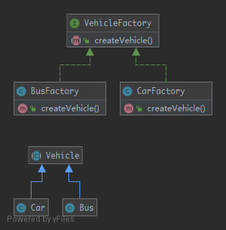

# FactoryMethod

The good point over the `SimpleFactory` is you can subclass it to implement different ways to create objects. For simple cases, this abstract class could be just an interface. This pattern is a "real" design pattern because it achieves the dependency Inversion principle as known as the "D" in SOLID principles. It means the `FactoryMethod` class depends on abstractions, not concrete classes. This is the real trick compared to `SimpleFactory` or `StaticFactory` .

## UML



## Code

Vehicle.php

```php
<?php

namespace Kuriv\PHPDesignPatterns\Creational\FactoryMethod;

abstract class Vehicle
{
}

```

Bus.php

```php
<?php

namespace Kuriv\PHPDesignPatterns\Creational\FactoryMethod;

class Bus extends Vehicle
{
}

```

Car.php

```php
<?php

namespace Kuriv\PHPDesignPatterns\Creational\FactoryMethod;

class Car extends Vehicle
{
}

```

VehicleFactory.php

```php
<?php

namespace Kuriv\PHPDesignPatterns\Creational\FactoryMethod;

interface VehicleFactory
{
    /**
     * Create vehicle.
     *
     * @param  void
     * @return Vehicle
     */
    public function createVehicle(): Vehicle;
}

```

BusFactory.php

```php
<?php

namespace Kuriv\PHPDesignPatterns\Creational\FactoryMethod;

class BusFactory implements VehicleFactory
{
    /**
     * Create vehicle.
     *
     * @param  void
     * @return Vehicle
     */
    public function createVehicle(): Vehicle
    {
        return new Bus;
    }
}

```

CarFactory.php

```php
<?php

namespace Kuriv\PHPDesignPatterns\Creational\FactoryMethod;

class CarFactory implements VehicleFactory
{
    /**
     * Create vehicle.
     *
     * @param  void
     * @return Vehicle
     */
    public function createVehicle(): Vehicle
    {
        return new Car;
    }
}

```

## Test

FactoryMethodTest.php

```php
<?php

namespace Kuriv\PHPDesignPatterns\Creational\FactoryMethod;

use PHPUnit\Framework\TestCase;

class FactoryMethodTest extends TestCase
{
    public function testCanCreateBus()
    {
        $busFactory = new BusFactory;
        $bus = $busFactory->createVehicle();
        $this->assertInstanceOf(Bus::class, $bus);
    }

    public function testCanCreateCar()
    {
        $carFactory = new CarFactory;
        $car = $carFactory->createVehicle();
        $this->assertInstanceOf(Car::class, $car);
    }
}

```

