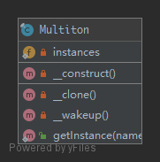

# Multiton

**THIS IS CONSIDERED TO BE AN ANTI-PATTERN! FOR BETTER TESTABILITY AND MAINTAINABILITY USE DEPENDENCY INJECTION!**

To have only a list of named instances that are used, like a singleton but with several instances.

## UML



## Code

Multiton.php

```php
<?php

namespace PHPDesignPatterns\Creational\Multiton;

final class Multiton
{
    /**
     * Store several instances.
     *
     * @var array
     */
    private static $instances = [];

    /**
     * Prevent the instance from being constructed.
     *
     * @param  void
     * @return void
     */
    private function __construct()
    {
    }

    /**
     * Prevent the instance from being cloned.
     *
     * @param  void
     * @return void
     */
    private function __clone()
    {
    }

    /**
     * Prevent the instance from being unserialized.
     *
     * @param  void
     * @return void
     */
    private function __wakeup()
    {
    }

    /**
     * Get the instance via lazy initialization.
     *
     * @param  string $name
     * @return Multiton
     */
    public static function getInstance(string $name): Multiton
    {
        static::$instances[$name] ?? static::$instances[$name] = new static;
        return static::$instances[$name];
    }
}

```

## Test

