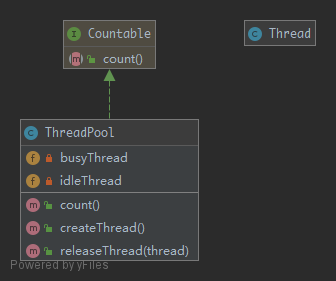

# Pool

## Purpose

This pattern uses a set of initialized objects kept ready to use a "pool" rather than allocating and destroying them on demand. A client of the pool will request an object from the pool and perform operations on the returned object. When the client has finished, it returns the object, which is a specific type of factory object, to the pool rather than destroying it. This can offer a significant performance boost in situations where the cost of initializing a class instance is high, the rate of instantiation of a class is high, and the number of instances in use at any one time is low. However these benefits are mostly true for objects that are expensive with respect to time, such as database connections, socket connections, threads and large graphic objects like fonts or bitmaps. In certain situations, simple object pooling may not be efficient and could decrease performance.

## UML



## Code

Thread.php

```php
<?php

namespace PHPDesignPatterns\Creational\Pool;

class Thread
{
}

```

ThreadPool.php

```php
<?php

namespace PHPDesignPatterns\Creational\Pool;

use Countable;

class ThreadPool implements Countable
{
    /**
     * Idle thread.
     *
     * @var array
     */
    private $idleThread = [];

    /**
     * Busy thread.
     *
     * @var array
     */
    private $busyThread = [];

    /**
     * Create a thread.
     *
     * @param  void
     * @return Thread
     */
    public function createThread(): Thread
    {
        $thread = count($this->idleThread) == 0 ? new Thread : array_pop($this->idleThread);
        return $this->busyThread[spl_object_hash($thread)] = $thread;
    }

    /**
     * Release a thread.
     *
     * @param  Thread $thread
     * @return void
     */
    public function releaseThread(Thread $thread)
    {
        $hash = spl_object_hash($thread);
        if (isset($this->busyThread[$hash])) {
            unset($this->busyThread[$hash]);
            $this->idleThread[$hash] = $thread;
        }
    }

    /**
     * Count the total number of threads.
     *
     * @param  void
     * @return int
     */
    public function count(): int
    {
        return count($this->idleThread) + count($this->busyThread);
    }
}

```

## Test