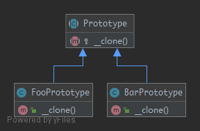

# Prototype

## Purpose

To avoid the cost of creating objects the standard way and instead create a prototype and clone it.

## UML



## Code

Prototype.php

```php
<?php

namespace PHPDesignPatterns\Creational\Prototype;

abstract class Prototype
{
    /**
     * Do something when the instance being cloned.
     *
     * @param  void
     * @return void
     */
    abstract protected function __clone();
}

```

FooPrototype.php

```php
<?php

namespace PHPDesignPatterns\Creational\Prototype;

class FooPrototype extends Prototype
{
    /**
     * Do something when the instance being cloned.
     *
     * @param  void
     * @return void
     */
    public function __clone()
    {
    }
}

```

BarPrototype.php

```php
<?php

namespace PHPDesignPatterns\Creational\Prototype;

class BarPrototype extends Prototype
{
    /**
     * Do something when the instance being cloned.
     *
     * @param  void
     * @return void
     */
    public function __clone()
    {
    }
}

```

## Test