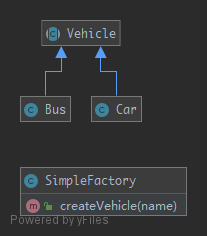

# SimpleFactory

> It differs from the `StaticFactory` because it is not static. Therefore, you can have multiple factories, differently parameterized, you can subclass it and you can mock it. It always should be preferred over a static factory.

## UML



## Code

Vehicle.php

```php
<?php

namespace Kuriv\PHPDesignPatterns\Creational\SimpleFactory;

abstract class Vehicle
{
}

```

Bus.php

```php
<?php

namespace Kuriv\PHPDesignPatterns\Creational\SimpleFactory;

class Bus extends Vehicle
{
}

```

Car.php

```php
<?php

namespace Kuriv\PHPDesignPatterns\Creational\SimpleFactory;

class Car extends Vehicle
{
}

```

SimpleFactory.php

```php
<?php

namespace Kuriv\PHPDesignPatterns\Creational\SimpleFactory;

class SimpleFactory
{
    /**
     * Create vehicle.
     *
     * @param  string $name
     * @return Vehicle
     */
    public function createVehicle(string $name): Vehicle
    {
        if ($name == 'Bus') {
            return new Bus;
        }
        if ($name == 'Car') {
            return new Car;
        }
    }
}

```

## Test

SimpleFactoryTest.php

```php
<?php

namespace Kuriv\PHPDesignPatterns\Creational\SimpleFactory;

use PHPUnit\Framework\TestCase;

class SimpleFactoryTest extends TestCase
{
    public function testCanCreateBus()
    {
        $bus = (new SimpleFactory)->createVehicle('Bus');
        $this->assertInstanceOf(Bus::class, $bus);
    }

    public function testCanCreateCar()
    {
        $car = (new SimpleFactory)->createVehicle('Car');
        $this->assertInstanceOf(Car::class, $car);
    }
}

```

