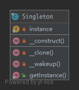

# Singleton

**THIS IS CONSIDERED TO BE AN ANTI-PATTERN! FOR BETTER TESTABILITY AND MAINTAINABILITY USE DEPENDENCY INJECTION!**

To have only one instance of this object in the application that will handle all calls.

## UML



## Code

Singleton.php

```php
<?php

namespace PHPDesignPatterns\Creational\Singleton;

final class Singleton
{
    /**
     * Store the current instance.
     *
     * @var Singleton
     */
    private static $instance;

    /**
     * Prevent the instance from being constructed.
     *
     * @param  void
     * @return void
     */
    private function __construct()
    {
    }

    /**
     * Prevent the instance from being cloned.
     *
     * @param  void
     * @return void
     */
    private function __clone()
    {
    }

    /**
     * Prevent the instance from being unserialized.
     *
     * @param  void
     * @return void
     */
    private function __wakeup()
    {
    }

    /**
     * Get the instance via lazy initialization.
     *
     * @param  void
     * @return Singleton
     */
    public static function getInstance(): Singleton
    {
        static::$instance ?? static::$instance = new static;
        return static::$instance;
    }
}

```

## Test

SingletonTest.php

```php
<?php

namespace PHPDesignPatterns\Creational\Singleton;

use PHPUnit\Framework\TestCase;
use PHPDesignPatterns\Creational\Singleton\Singleton;

class SingletonTest extends TestCase
{
    public function testUniqueness()
    {
        $firstInstance = Singleton::getinstance();
        $this->assertInstanceOf(Singleton::class, $firstInstance);

        $secoedInstance = Singleton::getinstance();
        $this->assertSame($firstInstance, $secoedInstance);
    }
}

```

