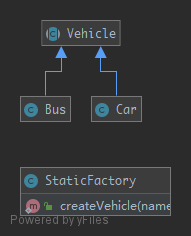

# StaticFactory

Similar to the `AbstractFactory` , this pattern is used to create series of related or dependent objects. The difference between this and the abstract factory pattern is that the static factory pattern uses just one static method to create all types of objects it can create.

## UML



## Code

Vehicle.php

```php
<?php

namespace PHPDesignPatterns\Creational\StaticFactory;

abstract class Vehicle
{
}

```

Bus.php

```php
<?php

namespace PHPDesignPatterns\Creational\StaticFactory;

class Bus extends Vehicle
{
}

```

Car.php

```php
<?php

namespace PHPDesignPatterns\Creational\StaticFactory;

class Car extends Vehicle
{
}

```

StaticFactory.php

```php
<?php

namespace PHPDesignPatterns\Creational\StaticFactory;

class StaticFactory
{
    /**
     * Create vehicle.
     *
     * @param  string $name
     * @return Vehicle
     */
    public static function createVehicle(string $name): Vehicle
    {
        if ($name == 'Bus') {
            return new Bus;
        }
        if ($name == 'Car') {
            return new Car;
        }
    }
}

```

## Test

StaticFactoryTest.php

```php
<?php

namespace PHPDesignPatterns\Creational\StaticFactory;

use PHPUnit\Framework\TestCase;
use PHPDesignPatterns\Creational\StaticFactory\StaticFactory;
use PHPDesignPatterns\Creational\StaticFactory\Bus;
use PHPDesignPatterns\Creational\StaticFactory\Car;

class StaticFactoryTest extends TestCase
{
    public function testCanCreateBus()
    {
        $bus = StaticFactory::createVehicle('Bus');
        $this->assertInstanceOf(Bus::class, $bus);
    }

    public function testCanCreateCar()
    {
        $car = StaticFactory::createVehicle('Car');
        $this->assertInstanceOf(Car::class, $car);
    }
}

```

