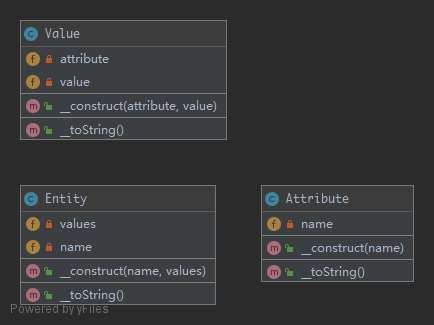

# EAV

The Entity–Attribute–Value (EAV) model is a data model to describe entities where the number of attributes that can be used to describe them is potentially vast, but the number that will actually apply to a given entity is relatively modest.

## UML



## Code

Entity.php

```php
<?php

namespace Kuriv\PHPDesignPatterns\More\EAV;

class Entity
{
    /**
     * Store the entity name.
     *
     * @var string
     */
    private $name;

    /**
     * Store several instances.
     *
     * @var array
     */
    private $instances = [];

    /**
     * Store the entity name and several instances to the current instance.
     *
     * @param  string $name
     * @param  array  $instances
     * @return void
     */
    public function __construct(string $name, array $instances)
    {
        $this->name = $name;
        foreach ($instances as $instance) {
            $this->instances[] = $instance;
        }
    }

    /**
     * Return the string containing all information.
     *
     * @param  void
     * @return string
     */
    public function __toString(): string
    {
        $string[] = $this->name;
        foreach ($this->instances as $instance) {
            $string[] = (string) $instance;
        }
        return implode(', ', $string);
    }
}

```

Attribute.php

```php
<?php

namespace Kuriv\PHPDesignPatterns\More\EAV;

class Attribute
{
    /**
     * Store the attribute name.
     *
     * @var string
     */
    private $name;

    /**
     * Store the attribute name to the current instance.
     *
     * @param  string $name
     * @return void
     */
    public function __construct(string $name)
    {
        $this->name = $name;
    }

    /**
     * Return the attribute name.
     *
     * @param  void
     * @return string
     */
    public function __toString(): string
    {
        return $this->name;
    }
}

```

Value.php

```php
<?php

namespace Kuriv\PHPDesignPatterns\More\EAV;

class Value
{
    /**
     * Store the attribute instance.
     *
     * @var Attribute
     */
    private $attribute;

    /**
     * Store the value string.
     *
     * @var string
     */
    private $value;

    /**
     * Store the attribute instance and value string to the current instance.
     *
     * @param  Attribute $attribute
     * @param  string    $value
     * @return void
     */
    public function __construct(Attribute $attribute, string $value)
    {
        $this->attribute = $attribute;
        $this->value = $value;
    }

    /**
     * Return the formatted string.
     *
     * @param  void
     * @return string
     */
    public function __toString(): string
    {
        return sprintf('%s: %s', (string) $this->attribute, $this->value);
    }
}

```

## Test

EAVTest.php

```php
<?php

namespace Kuriv\PHPDesignPatterns\More\EAV;

use PHPUnit\Framework\TestCase;

class EAVTest extends TestCase
{
    public function testCanAddAttributeToEntity()
    {
        $colorAttribute = new Attribute('color');
        $colorSilver = new Value($colorAttribute, 'silver');
        $colorBlack = new Value($colorAttribute, 'black');
        $memoryAttribute = new Attribute('memory');
        $memory8GB = new Value($memoryAttribute, '8GB');
        $entity = new Entity('MacBook Pro', [$colorSilver, $colorBlack, $memory8GB]);
        $this->assertEquals('MacBook Pro, color: silver, color: black, memory: 8GB', (string) $entity);
    }
}

```

