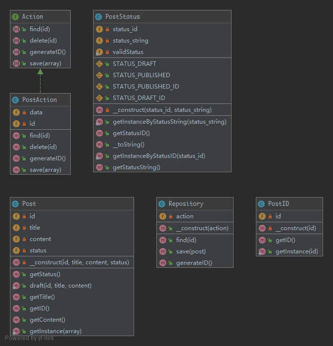

# Repository

> Mediates between the domain and data mapping layers using a collection-like interface for accessing domain objects. `Repository` encapsulates the set of objects persisted in a data store and the operations performed over them, providing a more object-oriented view of the persistence layer. `Repository` also supports the objective of achieving a clean separation and one-way dependency between the domain and data mapping layers.

## UML



## Code

Post.php

```php
<?php

namespace Kuriv\PHPDesignPatterns\More\Repository;

class Post
{
    /**
     * Store the ID instance.
     *
     * @var PostID
     */
    private PostID $id;

    /**
     * Store the title.
     *
     * @var string
     */
    private string $title;

    /**
     * Store the content.
     *
     * @var string
     */
    private string $content;

    /**
     * Store the status instance.
     *
     * @var PostStatus
     */
    private PostStatus $status;

    /**
     * Store the ID instance, title, content and status instance to the current instance.
     *
     * @param  PostID     $id
     * @param  string     $title
     * @param  string     $content
     * @param  PostStatus $status
     * @return void
     */
    private function __construct(PostID $id, string $title, string $content, PostStatus $status)
    {
        $this->id = $id;
        $this->title = $title;
        $this->content = $content;
        $this->status = $status;
    }

    /**
     * Get the instance of the draft.
     *
     * @param  PostID $id
     * @param  string $title
     * @param  string $content
     * @return Post
     */
    public static function draft(PostID $id, string $title, string $content): Post
    {
        return new self($id, $title, $content, PostStatus::getInstanceByStatusString(PostStatus::STATUS_DRAFT));
    }

    /**
     * Get the created instance.
     *
     * @param  array  $array
     * @return Post
     */
    public static function getInstance(array $array): Post
    {
        return new self(PostID::getInstance($array['id']), $array['title'], $array['content'], PostStatus::getInstanceByStatusID($array['status_id']));
    }

    /**
     * Get the ID instance.
     *
     * @param  void
     * @return PostID
     */
    public function getID(): PostID
    {
        return $this->id;
    }

    /**
     * Get the title.
     *
     * @param  void
     * @return string
     */
    public function getTitle(): string
    {
        return $this->title;
    }

    /**
     * Get the content.
     *
     * @param  void
     * @return string
     */
    public function getContent(): string
    {
        return $this->content;
    }

    /**
     * Get the status instance.
     *
     * @param  void
     * @return PostStatus
     */
    public function getStatus(): PostStatus
    {
        return $this->status;
    }
}

```

PostID.php

```php
<?php

namespace Kuriv\PHPDesignPatterns\More\Repository;

use InvalidArgumentException;

class PostID
{
    /**
     * Store the ID.
     *
     * @var int
     */
    private int $id;

    /**
     * Store the ID to the current instance.
     *
     * @param  int $id
     * @return void
     */
    private function __construct(int $id)
    {
        $this->id = $id;
    }

    /**
     * Get the created instance.
     *
     * @param  int    $id
     * @return PostID
     */
    public static function getInstance(int $id): PostID
    {
        if ($id <= 0) {
            throw new InvalidArgumentException('Invalid ID given');
        }
        return new self($id);
    }

    /**
     * Get the ID.
     *
     * @param  void
     * @return int
     */
    public function getID(): int
    {
        return $this->id;
    }
}

```

PostStatus.php

```php
<?php

namespace Kuriv\PHPDesignPatterns\More\Repository;

use InvalidArgumentException;

class PostStatus
{
    /**
     * Just a test constant.
     *
     * @var int
     */
    const STATUS_DRAFT_ID = 1;

    /**
     * Just a test constant.
     *
     * @var string
     */
    const STATUS_DRAFT = 'Draft';

    /**
     * Just a test constant.
     *
     * @var int
     */
    const STATUS_PUBLISHED_ID = 2;

    /**
     * Just a test constant.
     *
     * @var string
     */
    const STATUS_PUBLISHED = 'Published';

    /**
     * Define an array of allowed status.
     *
     * @var array
     */
    private static array $validStatus = [
        self::STATUS_DRAFT_ID     => self::STATUS_DRAFT,
        self::STATUS_PUBLISHED_ID => self::STATUS_PUBLISHED
    ];

    /**
     * Store the status ID.
     *
     * @var int
     */
    private int $status_id;

    /**
     * Store the status string.
     *
     * @var string
     */
    private string $status_string;

    /**
     * Store the status ID and status string to the current instance.
     *
     * @param  int    $status_id
     * @param  string $status_string
     * @return void
     */
    private function __construct(int $status_id, string $status_string)
    {
        $this->status_id = $status_id;
        $this->status_string = $status_string;
    }

    /**
     * Return the current status string.
     *
     * @param  void
     * @return string
     */
    public function __toString(): string
    {
        return $this->status_string;
    }

    /**
     * Get the created instance by status ID.
     *
     * @param  int    $status_id
     * @return PostStatus
     */
    public static function getInstanceByStatusID(int $status_id): PostStatus
    {
        if (!isset(self::$validStatus[$status_id])) {
            throw new InvalidArgumentException('Invalid status ID given');
        }
        return new self($status_id, self::$validStatus[$status_id]);
    }

    /**
     * Get the created instance by status string.
     *
     * @param  string $status_string
     * @return PostStatus
     */
    public static function getInstanceByStatusString(string $status_string): PostStatus
    {
        if (!in_array($status_string, self::$validStatus, true)) {
            throw new InvalidArgumentException('Invalid status string given');
        }
        return new self(array_search($status_string, self::$validStatus, true), $status_string);
    }

    /**
     * Get the status ID.
     *
     * @param  void
     * @return int
     */
    public function getStatusID(): int
    {
        return $this->status_id;
    }

    /**
     * Get the status string.
     *
     * @param  void
     * @return string
     */
    public function getStatusString(): string
    {
        return $this->status_string;
    }
}

```

Action.php

```php
<?php

namespace Kuriv\PHPDesignPatterns\More\Repository;

interface Action
{
    /**
     * Generate an ID.
     *
     * @param  void
     * @return int
     */
    public function generateID(): int;

    /**
     * Find the specified data.
     *
     * @param  int    $id
     * @return array
     */
    public function find(int $id): array;

    /**
     * Save the data.
     *
     * @param  array  $array
     * @return void
     */
    public function save(array $array);

    /**
     * Delete the specified data.
     *
     * @param  int    $id
     * @return void
     */
    public function delete(int $id);
}

```

PostAction.php

```php
<?php

namespace Kuriv\PHPDesignPatterns\More\Repository;

use OutOfBoundsException;

class PostAction implements Action
{
    /**
     * Store the ID.
     *
     * @var int
     */
    private int $id = 0;

    /**
     * Store the data.
     *
     * @var array
     */
    private array $data = [];

    /**
     * Generate an ID.
     *
     * @param  void
     * @return int
     */
    public function generateID(): int
    {
        return ++$this->id;
    }

    /**
     * Find the specified data.
     *
     * @param  int    $id
     * @return array
     */
    public function find(int $id): array
    {
        if (!isset($this->data[$id])) {
            throw new OutOfBoundsException(sprintf('No data found for ID %d', $id));
        }
        return $this->data[$id];
    }

    /**
     * Save the data.
     *
     * @param  array  $array
     * @return void
     */
    public function save(array $array)
    {
        $this->data[$this->id] = $array;
    }

    /**
     * Delete the specified data.
     *
     * @param  int    $id
     * @return void
     */
    public function delete(int $id)
    {
        if (!isset($this->data[$id])) {
            throw new OutOfBoundsException(sprintf('No data found for ID %d', $id));
        }
        unset($this->data[$id]);
    }
}

```

Repository.php

```php
<?php

namespace Kuriv\PHPDesignPatterns\More\Repository;

use OutOfBoundsException;

class Repository
{
    /**
     * Store the action instance.
     *
     * @var Action
     */
    private Action $action;

    /**
     * Store the action instance to the current instance.
     *
     * @param  Action $action
     * @return void
     */
    public function __construct(Action $action)
    {
        $this->action = $action;
    }

    /**
     * Generate an ID instance.
     *
     * @param  void
     * @return PostID
     */
    public function generateID(): PostID
    {
        return PostID::getInstance($this->action->generateID());
    }

    /**
     * Get the specified instance.
     *
     * @param  PostID $id
     * @return Post
     */
    public function find(PostID $id): Post
    {
        try {
            $id = $id->getID();
            $result = $this->action->find($id);
        } catch (OutOfBoundsException $e) {
            throw new OutOfBoundsException(sprintf('Post with ID %d does not exist', $id), 0, $e);
        }
        return Post::getInstance($result);
    }

    /**
     * Save the data.
     *
     * @param  Post   $post
     * @return void
     */
    public function save(Post $post)
    {
        $this->action->save([
            'id'        => $post->getID()->getID(),
            'title'     => $post->getTitle(),
            'content'   => $post->getContent(),
            'status_id' => $post->getStatus()->getStatusID()
        ]);
    }
}

```

## Test

RepositoryTest.php

```php
<?php

namespace Kuriv\PHPDesignPatterns\More\Repository;

use PHPUnit\Framework\TestCase;
use OutOfBoundsException;

class RepositoryTest extends TestCase
{
    public function testCanGenerateID()
    {
        $repository = new Repository(new PostAction);
        $this->assertEquals(1, $repository->generateID()->getID());
    }

    public function testThrowsExceptionWhenTryingToFindPostWhichDoesNotExist()
    {
        $repository = new Repository(new PostAction);
        $this->expectException(OutOfBoundsException::class);
        $this->expectExceptionMessage('Post with ID 42 does not exist');
        $repository->find(PostID::getInstance(42));
    }

    public function testCanSavePostDraft()
    {
        $repository = new Repository(new PostAction);
        $id = $repository->generateID();
        $post = Post::draft($id, 'Repository', 'PHP Design Patterns');
        $repository->save($post);
        $this->assertEquals($id, $repository->find($id)->getID());
        $this->assertEquals(PostStatus::STATUS_DRAFT, (string) $post->getStatus());
    }
}

```

