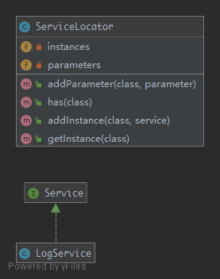

# ServiceLocator

**THIS IS CONSIDERED TO BE AN ANTI-PATTERN!**

`ServiceLocator` hides class dependencies instead of exposing them as you would do using the Dependency Injection. In case of changes of those dependencies you risk to break the functionality of classes which are using them, making your system difficult to maintain.

## UML



## Code

ServiceLocator.php

```php
<?php

namespace PHPDesignPatterns\More\ServiceLocator;

use OutOfRangeException;
use InvalidArgumentException;

class ServiceLocator
{
    /**
     * Store several instances.
     *
     * @var array
     */
    private $instances = [];

    /**
     * Store several arrays.
     *
     * @var array
     */
    private $arrays = [];

    /**
     * Store the service instance to the current instance.
     *
     * @param  string  $class
     * @param  Service $service
     * @return void
     */
    public function addInstance(string $class, Service $service)
    {
        $this->instances[$class] = $service;
    }

    /**
     * Store the array to the current instance.
     *
     * @param  string $class
     * @param  array  $array
     * @return void
     */
    public function addArray(string $class, array $array)
    {
        $this->arrays[$class] = $array;
    }

    /**
     * Check if there is a specified instance or array.
     *
     * @param  string  $class
     * @return bool
     */
    public function has(string $class): bool
    {
        return isset($this->instances[$class]) || isset($this->arrays[$class]);
    }

    /**
     * Get the created instance.
     *
     * @param  string $class
     * @return Service
     */
    public function get(string $class): Service
    {
        if (isset($this->instances[$class])) {
            return $this->instances[$class];
        }
        $array = $this->arrays[$class];
        switch (count($array)) {
            case 0:
                $instance = new $class;
                break;
            case 1:
                $instance = new $class($array[0]);
                break;
            case 2:
                $instance = new $class($array[0], $array[1]);
                break;
            case 3:
                $instance = new $class($array[0], $array[1], $array[2]);
                break;
            default:
                throw new OutOfRangeException('Too many arguments given');
                break;
        }
        if (!$instance instanceof Service) {
            throw new InvalidArgumentException(
                sprintf('Could not register service: %s is no instance of Service', get_class($instance))
            );
        }
        $this->addInstance($class, $instance);
        return $instance;
    }
}

```

Service.php

```php
<?php

namespace PHPDesignPatterns\More\ServiceLocator;

interface Service
{
}

```

LogService.php

```php
<?php

namespace PHPDesignPatterns\More\ServiceLocator;

class LogService implements Service
{
}

```

## Test

ServiceLocatorTest.php

```php
<?php

namespace PHPDesignPatterns\More\ServiceLocator;

use PHPUnit\Framework\TestCase;

class ServiceLocatorTest extends TestCase
{
    public function testHasServices()
    {
        $serviceLocator = new ServiceLocator;
        $serviceLocator->addInstance(LogService::class, new LogService);
        $this->assertTrue($serviceLocator->has(LogService::class));
        $this->assertFalse($serviceLocator->has(self::class));
    }

    public function testGetMethodWillInstantiateLogServiceIfNoInstanceHasBeenCreatedYet()
    {
        $serviceLocator = new ServiceLocator;
        $serviceLocator->addArray(LogService::class, []);
        $this->assertTrue($serviceLocator->has(LogService::class));
        $this->assertInstanceOf(LogService::class, $serviceLocator->get(LogService::class));
    }
}

```

