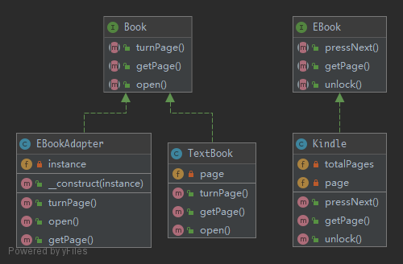

# Adapter

> To translate one interface for a class into a compatible interface. An adapter allows classes to work together that normally could not because of incompatible interfaces by providing its interface to clients while using the original interface.

## UML



## Code

Book.php

```php
<?php

namespace Kuriv\PHPDesignPatterns\Structural\Adapter;

interface Book
{
    /**
     * Open a book.
     *
     * @param  void
     * @return void
     */
    public function open();

    /**
     * Turn to the next page.
     *
     * @param  void
     * @return void
     */
    public function turnPage();

    /**
     * Get the current page.
     *
     * @param  void
     * @return int
     */
    public function getPage(): int;
}

```

TextBook.php

```php
<?php

namespace Kuriv\PHPDesignPatterns\Structural\Adapter;

class TextBook implements Book
{
    /**
     * Current page.
     *
     * @var int
     */
    private int $page;

    /**
     * Open a book.
     *
     * @param  void
     * @return void
     */
    public function open()
    {
        $this->page = 1;
    }

    /**
     * Turn to the next page.
     *
     * @param  void
     * @return void
     */
    public function turnPage()
    {
        $this->page++;
    }

    /**
     * Get the current page.
     *
     * @param  void
     * @return int
     */
    public function getPage(): int
    {
        return $this->page;
    }
}

```

EBook.php

```php
<?php

namespace Kuriv\PHPDesignPatterns\Structural\Adapter;

interface EBook
{
    /**
     * Unlock the screen.
     *
     * @param  void
     * @return void
     */
    public function unlock();

    /**
     * Press the next page.
     *
     * @param  void
     * @return void
     */
    public function pressNext();

    /**
     * Get the current page and total number of pages, like [10, 100].
     *
     * @param  void
     * @return array
     */
    public function getPage(): array;
}

```

Kindle.php

```php
<?php

namespace Kuriv\PHPDesignPatterns\Structural\Adapter;

class Kindle implements EBook
{
    /**
     * Current page.
     *
     * @var int
     */
    private int $page;

    /**
     * Total pages.
     *
     * @var int
     */
    private int $totalPages;

    /**
     * Unlock the screen.
     *
     * @param  void
     * @return void
     */
    public function unlock()
    {
        $this->page = 1;
        $this->totalPages = 100;
    }

    /**
     * Press the next page.
     *
     * @param  void
     * @return void
     */
    public function pressNext()
    {
        $this->page++;
    }

    /**
     * Get the current page and total number of pages, like [10, 100].
     *
     * @param  void
     * @return array
     */
    public function getPage(): array
    {
        return [$this->page, $this->totalPages];
    }
}

```

EBookAdapter.php

```php
<?php

namespace Kuriv\PHPDesignPatterns\Structural\Adapter;

class EBookAdapter implements Book
{
    /**
     * Instance that needs to be adapted.
     *
     * @var EBook
     */
    private EBook $instance;

    /**
     * Save the instance that needs to be adapted.
     *
     * @param  EBook $instance
     * @return void
     */
    public function __construct(EBook $instance)
    {
        $this->instance = $instance;
    }

    /**
     * Open a book.
     *
     * @param  void
     * @return void
     */
    public function open()
    {
        $this->instance->unlock();
    }

    /**
     * Turn to the next page.
     *
     * @param  void
     * @return void
     */
    public function turnPage()
    {
        $this->instance->pressNext();
    }

    /**
     * Get the current page.
     *
     * @param  void
     * @return int
     */
    public function getPage(): int
    {
        return $this->instance->getPage()[0];
    }
}

```

## Test

AdapterTest.php

```php
<?php

namespace Kuriv\PHPDesignPatterns\Structural\Adapter;

use PHPUnit\Framework\TestCase;

class AdapterTest extends TestCase
{
    public function testCanTurnPageOnTextBook()
    {
        $textbook = new TextBook;
        $textbook->open();
        $textbook->turnPage();
        $this->assertSame(2, $textbook->getPage());
    }

    public function testCanTurnPageOnKindleLikeInANormalTextBook()
    {
        $kindle = new EBookAdapter(new Kindle);
        $kindle->open();
        $kindle->turnPage();
        $this->assertSame(2, $kindle->getPage());
    }
}

```

