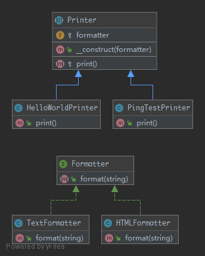

# Bridge

> Decouple an abstraction from its implementation so that the two can vary independently.

## UML



## Code

Formatter.php

```php
<?php

namespace Kuriv\PHPDesignPatterns\Structural\Bridge;

interface Formatter
{
    /**
     * Format the string.
     *
     * @param  string $string
     * @return string
     */
    public function format(string $string): string;
}

```

TextFormatter.php

```php
<?php

namespace Kuriv\PHPDesignPatterns\Structural\Bridge;

class TextFormatter implements Formatter
{
    /**
     * Format the string.
     *
     * @param  string $string
     * @return string
     */
    public function format(string $string): string
    {
        return $string;
    }
}

```

HTMLFormatter.php

```php
<?php

namespace Kuriv\PHPDesignPatterns\Structural\Bridge;

class HTMLFormatter implements Formatter
{
    /**
     * Format the string.
     *
     * @param  string $string
     * @return string
     */
    public function format(string $string): string
    {
        return sprintf('<p>%s</p>', $string);
    }
}

```

Printer.php

```php
<?php

namespace Kuriv\PHPDesignPatterns\Structural\Bridge;

abstract class Printer
{
    /**
     * Instance that used for bridging.
     *
     * @var Formatter
     */
    protected Formatter $formatter;

    /**
     * Store the instance that used for bridging.
     *
     * @param  Formatter $formatter
     * @return void
     */
    public function __construct(Formatter $formatter)
    {
        $this->formatter = $formatter;
    }

    /**
     * Print the string.
     *
     * @param  void
     * @return string
     */
    abstract protected function print(): string;
}

```

PingTestPrinter.php

```php
<?php

namespace Kuriv\PHPDesignPatterns\Structural\Bridge;

class PingTestPrinter extends Printer
{
    /**
     * Print the string.
     *
     * @param  void
     * @return string
     */
    public function print(): string
    {
        return $this->formatter->format('Ping Test');
    }
}

```

HelloWorldPrinter.php

```php
<?php

namespace Kuriv\PHPDesignPatterns\Structural\Bridge;

class HelloWorldPrinter extends Printer
{
    /**
     * Print the string.
     *
     * @param  void
     * @return string
     */
    public function print(): string
    {
        return $this->formatter->format('Hello World');
    }
}

```

## Test

BridgeTest.php

```php
<?php

namespace Kuriv\PHPDesignPatterns\Structural\Bridge;

use PHPUnit\Framework\TestCase;

class BridgeTest extends TestCase
{
    public function testCanPrintUsingTheTextFormatter()
    {
        $pingTestPrinter = new PingTestPrinter(new TextFormatter);
        $this->assertSame('Ping Test', $pingTestPrinter->print());

        $helloWorldPrinter = new HelloWorldPrinter(new TextFormatter);
        $this->assertSame('Hello World', $helloWorldPrinter->print());
    }

    public function testCanPrintUsingTheHTMLFormatter()
    {
        $pingTestPrinter = new PingTestPrinter(new HTMLFormatter);
        $this->assertSame('<p>Ping Test</p>', $pingTestPrinter->print());

        $helloWorldPrinter = new HelloWorldPrinter(new HTMLFormatter);
        $this->assertSame('<p>Hello World</p>', $helloWorldPrinter->print());
    }
}

```

