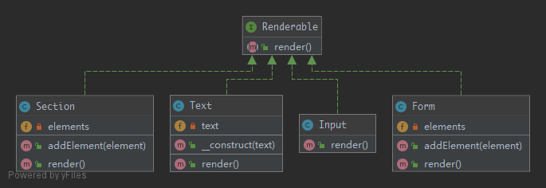

# Composite

To treat a group of objects the same way as a single instance of the object.

## UML



## Code

Renderable.php

```php
<?php

namespace Kuriv\PHPDesignPatterns\Structural\Composite;

interface Renderable
{
    /**
     * Render some components.
     *
     * @param  void
     * @return string
     */
    public function render(): string;
}

```

Text.php

```php
<?php

namespace Kuriv\PHPDesignPatterns\Structural\Composite;

class Text implements Renderable
{
    /**
     * Store a piece of text.
     *
     * @var string
     */
    private $text;

    /**
     * Store a piece of text to the current instance.
     *
     * @param  string $text
     * @return void
     */
    public function __construct(string $text)
    {
        $this->text = $text;
    }

    /**
     * Render a piece of text.
     *
     * @param  void
     * @return string
     */
    public function render(): string
    {
        return $this->text;
    }
}

```

Input.php

```php
<?php

namespace Kuriv\PHPDesignPatterns\Structural\Composite;

class Input implements Renderable
{
    /**
     * Render an input box.
     *
     * @param  void
     * @return string
     */
    public function render(): string
    {
        return '<input type="text">';
    }
}

```

Section.php

```php
<?php

namespace Kuriv\PHPDesignPatterns\Structural\Composite;

class Section implements Renderable
{
    /**
     * Store some elements.
     *
     * @var array
     */
    private $elements = [];

    /**
     * Render all elements stored in the current instance.
     *
     * @param  void
     * @return string
     */
    public function render(): string
    {
        $string = '<section>';
        foreach ($this->elements as $element) {
            $string .= $element->render();
        }
        $string .= '</section>';
        return $string;
    }

    /**
     * Store some elements to the current instance.
     *
     * @param  Renderable $element
     * @return void
     */
    public function addElement(Renderable $element)
    {
        $this->elements[] = $element;
    }
}

```

Form.php

```php
<?php

namespace Kuriv\PHPDesignPatterns\Structural\Composite;

class Form implements Renderable
{
    /**
     * Store some elements.
     *
     * @var array
     */
    private $elements = [];

    /**
     * Render all elements stored in the current instance.
     *
     * @param  void
     * @return string
     */
    public function render(): string
    {
        $string = '<form>';
        foreach ($this->elements as $element) {
            $string .= $element->render();
        }
        $string .= '</form>';
        return $string;
    }

    /**
     * Store some elements to the current instance.
     *
     * @param  Renderable $element
     * @return void
     */
    public function addElement(Renderable $element)
    {
        $this->elements[] = $element;
    }
}

```

## Test

CompositeTest.php

```php
<?php

namespace Kuriv\PHPDesignPatterns\Structural\Composite;

use PHPUnit\Framework\TestCase;

class CompositeTest extends TestCase
{
    public function testRender()
    {
        $form = new Form;
        $firstSection = new Section;
        $firstSection->addElement(new Text('Username:'));
        $firstSection->addElement(new Input);
        $form->addElement($firstSection);
        $secondSection = new Section;
        $secondSection->addElement(new Text('Password:'));
        $secondSection->addElement(new Input);
        $form->addElement($secondSection);
        $this->assertEquals(
            '<form><section>Username:<input type="text"></section><section>Password:<input type="text"></section></form>',
            $form->render()
        );
    }
}

```

