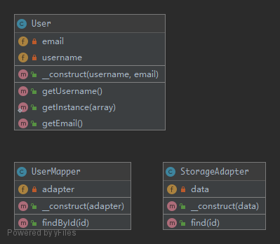

# DataMapper

Data Mapper is a Data Access Layer that performs bidirectional transfer of data between a persistent data store and an in memory data representation. The goal of the pattern is to keep the in memory representation and the persistent data store independent of each other and the data mapper itself. The layer is composed of one or more mappers, performing the data transfer. Mapper implementations vary in scope. Generic mappers will handle many different domain entity types, dedicated mappers will handle one or a few. The key point of this pattern is, unlike Active Record pattern, the data model follows Single Responsibility Principle.

## UML



## Code

User.php

```php
<?php

namespace PHPDesignPatterns\Structural\DataMapper;

class User
{
    /**
     * Store the username.
     *
     * @var string
     */
    private $username;

    /**
     * Store the email.
     *
     * @var string
     */
    private $email;

    /**
     * Store the username and email to the current instance.
     *
     * @param  string $username
     * @param  string $email
     * @return void
     */
    public function __construct(string $username, string $email)
    {
        $this->username = $username;
        $this->email = $email;
    }

    /**
     * Get the username.
     *
     * @param  void
     * @return string
     */
    public function getUsername(): string
    {
        return $this->username;
    }

    /**
     * Get the email.
     *
     * @param  void
     * @return string
     */
    public function getEmail(): string
    {
        return $this->email;
    }

    /**
     * Get the created instance.
     *
     * @param  array  $array
     * @return User
     */
    public static function getInstance(array $array): User
    {
        return new self($array['username'], $array['email']);
    }
}

```

StorageAdapter.php

```php
<?php

namespace PHPDesignPatterns\Structural\DataMapper;

class StorageAdapter
{
    /**
     * Store the data.
     *
     * @var array
     */
    private $data = [];

    /**
     * Store the data to the current instance.
     *
     * @param  array $data
     * @return void
     */
    public function __construct(array $data)
    {
        $this->data = $data;
    }

    /**
     * Find the specified data.
     *
     * @param  int    $id
     * @return array
     */
    public function find(int $id): array
    {
        return isset($this->data[$id]) ? $this->data[$id] : [];
    }
}

```

UserMapper.php

```php
<?php

namespace PHPDesignPatterns\Structural\DataMapper;

use InvalidArgumentException;

class UserMapper
{
    /**
     * Store the storage adapter instance.
     *
     * @var StorageAdapter
     */
    private $adapter;

    /**
     * Store the storage adapter instance to the current instance.
     *
     * @param  StorageAdapter $adapter
     * @return void
     */
    public function __construct(StorageAdapter $adapter)
    {
        $this->adapter = $adapter;
    }

    /**
     * Get the specified instance.
     *
     * @param  int    $id
     * @return User
     */
    public function findById(int $id): User
    {
        $result = $this->adapter->find($id);
        if (empty($result)) {
            throw new InvalidArgumentException(
                sprintf('User #%d not found', $id)
            );
        }
        return User::getInstance($result);
    }
}

```

## Test

DataMapperTest.php

```php
<?php

namespace PHPDesignPatterns\Structural\DataMapper;

use PHPUnit\Framework\TestCase;
use PHPDesignPatterns\Structural\DataMapper\User;

class DataMapperTest extends TestCase
{
    public function testCanMapUserFromStorage()
    {
        $data = [
            1 => [
                'username' => 'foo',
                'email' => 'foo@foo.com'
            ],
            2 => [
                'username' => 'bar',
                'email' => 'bar@bar.com'
            ]
        ];
        $adapter = new StorageAdapter($data);
        $mapper = new UserMapper($adapter);
        $user = $mapper->findById(1);
        $this->assertInstanceOf(User::class, $user);
    }

    // public function testWillNotMapInvalidData()
    // {
    //     $adapter = new StorageAdapter([]);
    //     $mapper = new UserMapper($adapter);
    //     $mapper->findById(1);
    // }
}

```

