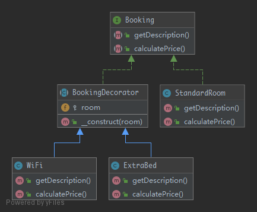

# Decorator

> To dynamically add new functionality to class instances.

## UML



## Code

Booking.php

```php
<?php

namespace Kuriv\PHPDesignPatterns\Structural\Decorator;

interface Booking
{
    /**
     * Calculate the price of the current room.
     *
     * @param  void
     * @return int
     */
    public function calculatePrice(): int;

    /**
     * Get the description of the current room.
     *
     * @param  void
     * @return string
     */
    public function getDescription(): string;
}

```

StandardRoom.php

```php
<?php

namespace Kuriv\PHPDesignPatterns\Structural\Decorator;

class StandardRoom implements Booking
{
    /**
     * Calculate the price of the current room.
     *
     * @param  void
     * @return int
     */
    public function calculatePrice(): int
    {
        return 100;
    }

    /**
     * Get the description of the current room.
     *
     * @param  void
     * @return string
     */
    public function getDescription(): string
    {
        return 'Standard room';
    }
}

```

BookingDecorator.php

```php
<?php

namespace Kuriv\PHPDesignPatterns\Structural\Decorator;

abstract class BookingDecorator implements Booking
{
    /**
     * Store the booking instance.
     *
     * @var Booking
     */
    protected Booking $room;

    /**
     * Store the booking instance to the current instance.
     *
     * @param  Booking $room
     * @return void
     */
    public function __construct(Booking $room)
    {
        $this->room = $room;
    }
}

```

WiFi.php

```php
<?php

namespace Kuriv\PHPDesignPatterns\Structural\Decorator;

class WiFi extends BookingDecorator
{
    /**
     * Calculate the price of the current room.
     *
     * @param  void
     * @return int
     */
    public function calculatePrice(): int
    {
        return $this->room->calculatePrice() + 50;
    }

    /**
     * Get the description of the current room.
     *
     * @param  void
     * @return string
     */
    public function getDescription(): string
    {
        return $this->room->getDescription() . ' with wifi';
    }
}

```

ExtraBed.php

```php
<?php

namespace Kuriv\PHPDesignPatterns\Structural\Decorator;

class ExtraBed extends BookingDecorator
{
    /**
     * Calculate the price of the current room.
     *
     * @param  void
     * @return int
     */
    public function calculatePrice(): int
    {
        return $this->room->calculatePrice() + 100;
    }

    /**
     * Get the description of the current room.
     *
     * @param  void
     * @return string
     */
    public function getDescription(): string
    {
        return $this->room->getDescription() . ' with extra bed';
    }
}

```

## Test

DecoratorTest.php

```php
<?php

namespace Kuriv\PHPDesignPatterns\Structural\Decorator;

use PHPUnit\Framework\TestCase;

class DecoratorTest extends TestCase
{
    public function testCanCalculatePriceForBasicStandardRoomBooking()
    {
        $booking = new StandardRoom();
        $this->assertSame(100, $booking->calculatePrice());
        $this->assertSame('Standard room', $booking->getDescription());
    }

    public function testCanCalculatePriceForStandardRoomBookingWithWiFi()
    {
        $booking = new WiFi(new StandardRoom());
        $this->assertSame(150, $booking->calculatePrice());
        $this->assertSame('Standard room with wifi', $booking->getDescription());
    }

    public function testCanCalculatePriceForStandardRoomBookingWithWiFiAndExtraBed()
    {
        $booking = new ExtraBed(new WiFi(new StandardRoom()));
        $this->assertSame(250, $booking->calculatePrice());
        $this->assertSame('Standard room with wifi with extra bed', $booking->getDescription());
    }
}

```

