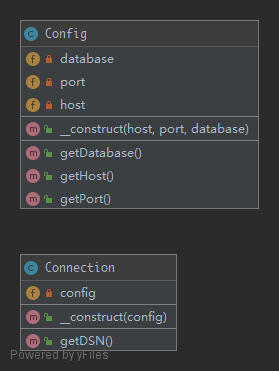

# DependencyInjection

To implement a loosely coupled architecture in order to get better testable, maintainable and extendable code.

## UML



## Code

Config.php

```php
<?php

namespace Kuriv\PHPDesignPatterns\Structural\DependencyInjection;

class Config
{
    /**
     * Store the config of the host.
     *
     * @var string
     */
    private $host;

    /**
     * Store the config of the port.
     *
     * @var int
     */
    private $port;

    /**
     * Store the config of the database.
     *
     * @var string
     */
    private $database;

    /**
     * Store all config to the current instance.
     *
     * @param  string $host
     * @param  int    $port
     * @param  string $database
     * @return void
     */
    public function __construct(string $host, int $port, string $database)
    {
        $this->host = $host;
        $this->port = $port;
        $this->database = $database;
    }

    /**
     * Get the config of the host.
     *
     * @param  void
     * @return string
     */
    public function getHost(): string
    {
        return $this->host;
    }

    /**
     * Get the config of the port.
     *
     * @param  void
     * @return int
     */
    public function getPort(): int
    {
        return $this->port;
    }

    /**
     * Get the config of the database.
     *
     * @param  void
     * @return string
     */
    public function getDatabase(): string
    {
        return $this->database;
    }
}

```

Connection.php

```php
<?php

namespace Kuriv\PHPDesignPatterns\Structural\DependencyInjection;

class Connection
{
    /**
     * Store the config instance.
     *
     * @var Config
     */
    private $config;

    /**
     * Store the config instance to the current instance.
     *
     * @param  Config $config
     * @return void
     */
    public function __construct(Config $config)
    {
        $this->config = $config;
    }

    /**
     * Get the DSN string.
     *
     * @param  void
     * @return string
     */
    public function getDSN(): string
    {
        return sprintf(
            'mysql:host=%s;port=%d;dbname=%s',
            $this->config->getHost(),
            $this->config->getPort(),
            $this->config->getDatabase()
        );
    }
}

```

## Test

DependencyInjectionTest.php

```php
<?php

namespace Kuriv\PHPDesignPatterns\Structural\DependencyInjection;

use PHPUnit\Framework\TestCase;

class DependencyInjectionTest extends TestCase
{
    public function testDependencyInjection()
    {
        $connection = new Connection(new Config('127.0.0.1', 3306, 'admin'));
        $this->assertEquals('mysql:host=127.0.0.1;port=3306;dbname=admin', $connection->getDSN());
    }
}

```


