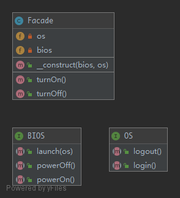

# Facade

The primary goal of a `Facade` pattern is not to avoid you having to read the manual of a complex API. It's only a side-effect. The first goal is to reduce coupling and follow the Law of Demeter. A `Facade` is meant to decouple a client and a sub-system by embedding many interface, and of course to reduce complexity.

## UML



## Code

BIOS.php

```php
<?php

namespace PHPDesignPatterns\Structural\Facade;

interface BIOS
{
    /**
     * Just a test method.
     *
     * @param  void
     * @return void
     */
    public function powerOn();

    /**
     * Just a test method.
     *
     * @param  OS     $os
     * @return void
     */
    public function launch(OS $os);

    /**
     * Just a test method.
     *
     * @param  void
     * @return void
     */
    public function powerOff();
}

```

OS.php

```php
<?php

namespace PHPDesignPatterns\Structural\Facade;

interface OS
{
    /**
     * Just a test method.
     *
     * @param  void
     * @return void
     */
    public function shutdown();

    /**
     * Just a test method.
     *
     * @param  void
     * @return void
     */
    public function login();
}

```

Facade.php

```php
<?php

namespace PHPDesignPatterns\Structural\Facade;

class Facade
{
    /**
     * Store the BIOS instance.
     *
     * @var BIOS
     */
    private $bios;

    /**
     * Store the OS instance.
     *
     * @var OS
     */
    private $os;

    /**
     * Store the BIOS instance and OS instance to the current instance.
     *
     * @param  BIOS $bios
     * @param  OS   $os
     * @return void
     */
    public function __construct(BIOS $bios, OS $os)
    {
        $this->bios = $bios;
        $this->os = $os;
    }

    /**
     * Build system turn on method.
     *
     * @param  void
     * @return void
     */
    public function turnOn()
    {
        $this->bios->powerOn();
        $this->bios->launch($this->os);
    }

    /**
     * Build system turn off method.
     *
     * @param  void
     * @return void
     */
    public function turnOff()
    {
        $this->os->shutdown();
        $this->bios->powerOff();
    }
}

```

## Test

FacadeTest.php

```php
<?php

namespace PHPDesignPatterns\Structural\Facade;

use PHPUnit\Framework\TestCase;
use PHPDesignPatterns\Structural\Facade\BIOS;
use PHPDesignPatterns\Structural\Facade\OS;

class FacadeTest extends TestCase
{
    public function testComputerOn()
    {
        $bios = $this->createMock(BIOS::class);
        $os = $this->createMock(OS::class);
        $os->method('login')->will($this->returnValue('Welcome'));
        $facade = new Facade($bios, $os);
        $facade->turnOn();
        $this->assertEquals('Welcome', $os->login());
        $facade->turnOff();
    }
}

```

