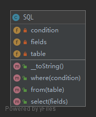

# FluentInterface

To write code that is easy readable just like sentences in a natural language.

## UML



## Code

Sql.php

```php
<?php

namespace PHPDesignPatterns\Structural\FluentInterface;

class Sql
{
    /**
     * Store the fields to be queried.
     *
     * @var array
     */
    private $fields = [];

    /**
     * Store the table to be queried.
     *
     * @var array
     */
    private $table = [];

    /**
     * Store the condition to be queried.
     *
     * @var array
     */
    private $condition = [];

    /**
     * Store the fields to be queried.
     *
     * @param  array  $fields
     * @return Sql
     */
    public function select(array $fields): Sql
    {
        $this->fields = $fields;
        return $this;
    }

    /**
     * Store the table to be queried.
     *
     * @param  string $table
     * @return Sql
     */
    public function from(string $table): Sql
    {
        $this->table[] = $table;
        return $this;
    }

    /**
     * Store the condition to be queried.
     *
     * @param  string $condition
     * @return Sql
     */
    public function where(string $condition): Sql
    {
        $this->condition[] = $condition;
        return $this;
    }

    /**
     * Return formatted SQL statement.
     *
     * @param  void
     * @return string
     */
    public function __toString(): string
    {
        return sprintf(
            'SELECT %s FROM %s WHERE %s',
            implode(', ', $this->fields),
            implode(', ', $this->table),
            implode(', ', $this->condition)
        );
    }
}

```

## Test