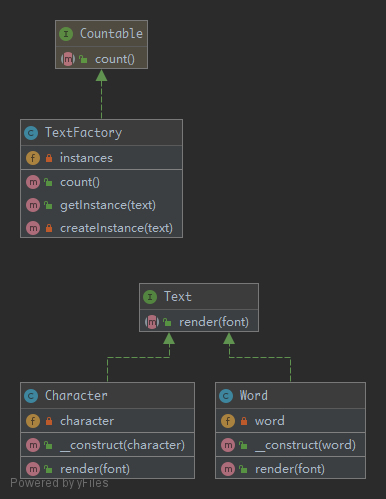

# Flyweight

To minimise memory usage, a `Flyweight` shares as much as possible memory with similar objects. It is needed when a large amount of objects is used that don't differ much in state. A common practice is to hold state in external data structures and pass them to the flyweight object when needed.

## UML



## Code

Text.php

```php
<?php

namespace PHPDesignPatterns\Structural\Flyweight;

interface Text
{
    /**
     * Render a piece of text.
     *
     * @param  string $font
     * @return string
     */
    public function render(string $font): string;
}

```

Character.php

```php
<?php

namespace PHPDesignPatterns\Structural\Flyweight;

class Character implements Text
{
    /**
     * Store a character.
     *
     * @var string
     */
    private $character;

    /**
     * Store a character to the current instance.
     *
     * @param  string $character
     * @return void
     */
    public function __construct(string $character)
    {
        $this->character = $character;
    }

    /**
     * Render a character.
     *
     * @param  string $font
     * @return string
     */
    public function render(string $font): string
    {
        return sprintf('Character %s with font %s', $this->character, $font);
    }
}

```

Word.php

```php
<?php

namespace PHPDesignPatterns\Structural\Flyweight;

class Word implements Text
{
    /**
     * Store a word.
     *
     * @var string
     */
    private $word;

    /**
     * Store a word to the current instance.
     *
     * @param  string $word
     * @return void
     */
    public function __construct(string $word)
    {
        $this->word = $word;
    }

    /**
     * Render a word.
     *
     * @param  string $font
     * @return string
     */
    public function render(string $font): string
    {
        return sprintf('Word %s with font %s', $this->word, $font);
    }
}

```

TextFactory.php

```php
<?php

namespace PHPDesignPatterns\Structural\Flyweight;

use Countable;

class TextFactory implements Countable
{
    /**
     * Store several instances.
     *
     * @var array
     */
    private $instances = [];

    /**
     * Get the specified instance.
     *
     * @param  string $string
     * @return Text
     */
    public function getInstance(string $string): Text
    {
        $this->instances[$string] ?? $this->instances[$string] = $this->createInstance($string);
        return $this->instances[$string];
    }

    /**
     * Create the specified instance.
     *
     * @param  string $string
     * @return Text
     */
    private function createInstance(string $string): Text
    {
        return strlen($string) == 1 ? new Character($string) : new Word($string);
    }

    /**
     * Count the total number of instances.
     *
     * @param  void
     * @return int
     */
    public function count(): int
    {
        return count($this->instances);
    }
}

```

## Test

FlyweightTest.php

```php
<?php

namespace PHPDesignPatterns\Structural\Flyweight;

use PHPUnit\Framework\TestCase;

class FlyweightTest extends TestCase
{
    private $characters = ['a', 'b', 'c', 'd', 'e', 'f', 'g', 'h', 'i', 'j', 'k', 'l', 'm', 'n', 'o', 'p', 'q', 'r', 's', 't', 'u', 'v', 'w', 'x', 'y', 'z'];

    private $fonts = ['Arial', 'Times New Roman', 'Verdana', 'Helvetica'];

    public function testFlyweight()
    {
        $factory = new TextFactory();
        foreach ($this->characters as $character) {
            foreach ($this->fonts as $font) {
                $flyweight = $factory->getInstance($character);
                $this->assertSame(
                    sprintf('Character %s with font %s', $character, $font),
                    $flyweight->render($font)
                );
            }
        }

        foreach ($this->fonts as $word) {
            $flyweight = $factory->getInstance($word);
            $this->assertSame(
                sprintf('Word %s with font foo', $word),
                $flyweight->render('foo')
            );
        }

        $this->assertCount(count($this->characters) + count($this->fonts), $factory);
    }
}

```

