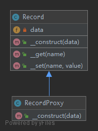

# Proxy

> To interface to anything that is expensive or impossible to duplicate.

## UML



## Code

Record.php

```php
<?php

namespace Kuriv\PHPDesignPatterns\Structural\Proxy;

use InvalidArgumentException;

class Record
{
    /**
     * Store some data here.
     *
     * @var array
     */
    private array $data = [];

    /**
     * Store some data to the current instance.
     *
     * @param  array $data
     * @return void
     */
    public function __construct(array $data = [])
    {
        $this->data = $data;
    }

    /**
     * Set the value of the specified name.
     *
     * @param  string $name
     * @param  string $value
     * @return void
     */
    public function __set(string $name, string $value)
    {
        $this->data[$name] = $value;
    }

    /**
     * Get the value of the specified name.
     *
     * @param  string $name
     * @return string
     */
    public function __get(string $name): string
    {
        if (!isset($this->data[$name])) {
            throw new InvalidArgumentException('Invalid name given');
        }
        return $this->data[$name];
    }
}

```

RecordProxy.php

```php
<?php

namespace Kuriv\PHPDesignPatterns\Structural\Proxy;

class RecordProxy extends Record
{
    /**
     * Store some data to the parent instance.
     *
     * @param  array $data
     * @return void
     */
    public function __construct(array $data = [])
    {
        $data = array_map(fn(int $value): int => $value ** 2, $data);
        parent::__construct($data);
    }
}

```

## Test

ProxyTest.php

```php
<?php

namespace Kuriv\PHPDesignPatterns\Structural\Proxy;

use PHPUnit\Framework\TestCase;

class ProxyTest extends TestCase
{
    public function testSetData()
    {
        $data = ['foo' => 10];
        $proxy = new RecordProxy($data);
        $this->assertTrue($proxy->foo == 100);

        $proxy->bar = 20;
        $this->assertTrue($proxy->bar == 20);
    }
}

```

