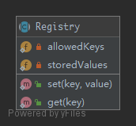

# Registry

**REMEMBER THAT THIS INTRODUCES GLOBAL STATE, WHICH SHOULD BE AVOIDED AT ALL TIMES! INSTEAD IMPLEMENT IT USING DEPENDENCY INJECTION!**

> To implement a central storage for objects often used throughout the application, is typically implemented using an abstract class with only static methods, or using the `Singleton` .

## UML



## Code

Registry.php

```php
<?php

namespace Kuriv\PHPDesignPatterns\Structural\Registry;

use InvalidArgumentException;
use stdClass;

abstract class Registry
{
    /**
     * Define an array of allowed keys.
     *
     * @var array
     */
    private static array $allowedKeys = ['foo'];

    /**
     * Store all allowed values.
     *
     * @var array
     */
    private static array $storedValues = [];

    /**
     * Store the value of the specified key.
     *
     * @param  string   $key
     * @param  stdClass $value
     * @return void
     */
    public static function set(string $key, stdClass $value)
    {
        if (!in_array($key, self::$allowedKeys)) {
            throw new InvalidArgumentException('Invalid key given');
        }
        self::$storedValues[$key] = $value;
    }

    /**
     * Get the value of the specified key.
     *
     * @param  string $key
     * @return stdClass
     */
    public static function get(string $key): stdClass
    {
        if (!in_array($key, self::$allowedKeys) || !isset(self::$storedValues[$key])) {
            throw new InvalidArgumentException('Invalid key given');
        }
        return self::$storedValues[$key];
    }
}

```

## Test

RegistryTest.php

```php
<?php

namespace Kuriv\PHPDesignPatterns\Structural\Registry;

use PHPUnit\Framework\TestCase;
use InvalidArgumentException;
use stdClass;

class RegistryTest extends TestCase
{
    public function testSetAndGet()
    {
        $class = new stdClass;
        Registry::set('foo', $class);
        $storedClass = Registry::get('foo');
        $this->assertSame($class, $storedClass);
        $this->assertInstanceOf(stdClass::class, $storedClass);
    }

    public function testThrowsExceptionWhenTryingToSetInvalidKey()
    {
        $this->expectException(InvalidArgumentException::class);
        $this->expectExceptionMessage('Invalid key given');
        Registry::set('bar', new stdClass);
    }

    public function testThrowsExceptionWhenTryingToGetNotSetKey()
    {
        $this->expectException(InvalidArgumentException::class);
        $this->expectExceptionMessage('Invalid key given');
        Registry::get('bar');
    }
}

```

